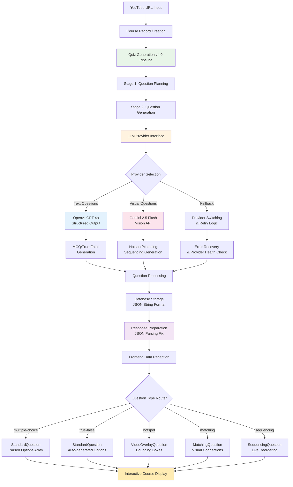
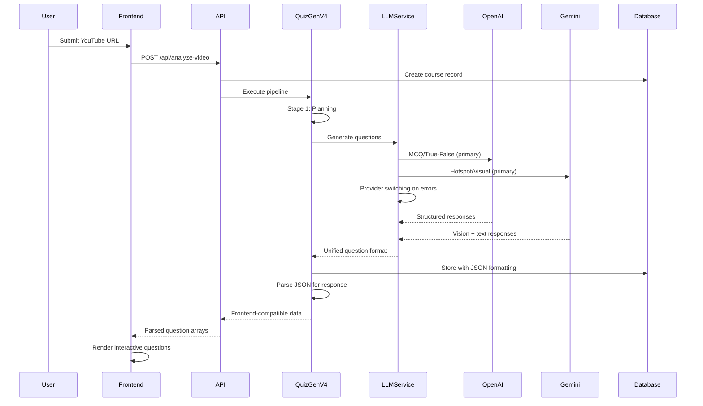
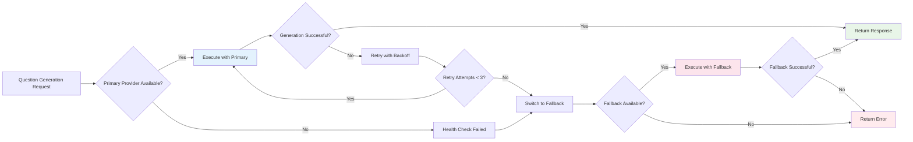

# CourseForge AI - Course Generation Pipeline Documentation

*Complete Technical Reference for the YouTube-to-Interactive-Course System v4.0*

---

## 📋 Table of Contents

1. [Overview](#overview)
2. [Pipeline Architecture v4.0](#pipeline-architecture-v40)
3. [LLM Provider Interface](#llm-provider-interface)
4. [Data Flow Diagrams](#data-flow-diagrams)
5. [Question Types & Data Structures](#question-types--data-structures)
6. [Database Schema](#database-schema)
7. [API Endpoints](#api-endpoints)
8. [Visualization Components](#visualization-components)
9. [Current Implementation Status](#current-implementation-status)
10. [Technical Specifications](#technical-specifications)

---

## 1. Overview

CourseForge AI transforms YouTube educational videos into comprehensive, interactive courses using advanced AI technologies with a unified LLM provider interface. The system now supports **dual LLM providers** (OpenAI + Gemini) with automatic provider switching, enhanced error handling, and comprehensive quality control.

### Key Capabilities
- **Dual LLM Provider Support** with OpenAI GPT-4o and Google Gemini 2.5 Flash
- **Provider-specific optimization** with text questions via OpenAI and visual questions via Gemini Vision
- **Automatic provider switching** with health checks and fallback mechanisms
- **Enhanced error handling** with retry logic and rate limiting
- **Real-time video analysis** with native object detection
- **Educational framework integration** with Bloom's taxonomy classification
- **Interactive visual questions** with precise coordinate positioning
- **Quality-controlled generation** with automated assessment pipeline

---

## 2. Pipeline Architecture v4.0



### Processing Stages

1. **Question Planning** - Strategic question type and timestamp planning
2. **Question Generation** - Multi-provider LLM generation with fallback
3. **Quality Verification** - Optional comprehensive quality assessment
4. **Database Storage** - Structured storage with JSON format handling
5. **Response Processing** - Frontend-compatible data formatting
6. **Interactive Rendering** - Provider-agnostic question visualization

---

## 3. LLM Provider Interface

### 3.1 Unified Provider Architecture

The system implements a **unified LLM interface** that abstracts provider differences and enables seamless switching:

```typescript
interface LLMProvider {
  generateResponse(prompt: string, questionType: string, config: any): Promise<LLMResponse>;
  healthCheck(): Promise<boolean>;
  getTokenUsage(): TokenUsage;
}

class LLMService {
  private providers: Map<string, LLMProvider>;
  private config: ProviderConfig;
  
  async generateQuestion(questionType: string, prompt: string, config: any): Promise<LLMResponse> {
    const preferredProvider = this.getPreferredProvider(questionType);
    return await this.executeWithFallback(preferredProvider, prompt, questionType, config);
  }
}
```

### 3.2 Provider Configuration

**Default Provider Assignment:**
- **OpenAI (Primary)**: Multiple Choice, True/False questions
- **Gemini (Primary)**: Hotspot questions with vision capabilities
- **Both Providers**: Matching and Sequencing with fallback support

**Configuration Details:**
```typescript
const PROVIDER_CONFIG = {
  'multiple-choice': { preferredProvider: 'openai', fallback: 'gemini' },
  'true-false': { preferredProvider: 'openai', fallback: 'gemini' },
  'hotspot': { preferredProvider: 'gemini', fallback: null }, // Vision required
  'matching': { preferredProvider: 'openai', fallback: 'gemini' },
  'sequencing': { preferredProvider: 'openai', fallback: 'gemini' }
};
```

### 3.3 Enhanced Error Handling

**Multi-layer Error Recovery:**
- **3-attempt retry system** with exponential backoff
- **Rate limiting protection** with randomized delays
- **Provider health monitoring** with automatic switching
- **Schema compatibility fixes** for OpenAI strict mode
- **Comprehensive logging** for debugging and monitoring

---

## 4. Data Flow Diagrams

### 4.1 Complete Pipeline Flow



### 4.2 Provider Switching Logic



---

## 5. Question Types & Data Structures

### 5.1 Unified Question Interface

All question types now follow a consistent interface with provider-agnostic processing:

```typescript
interface BaseQuestion {
  id: string;
  type: QuestionType;
  question: string;
  timestamp: number;
  explanation: string;
  provider_used?: 'openai' | 'gemini';
  token_usage?: TokenUsage;
}

interface MultipleChoiceQuestion extends BaseQuestion {
  type: 'multiple-choice';
  options: string[]; // Parsed from JSON in response
  correct_answer: number;
  educational_rationale?: string;
  bloom_level?: string;
}
```

### 5.2 Frontend Data Format

**Critical Fix Applied**: The backend now properly parses JSON strings back to arrays for frontend compatibility:

```typescript
// Backend response preparation
if (sq.type === 'multiple-choice' && sq.options && typeof sq.options === 'string') {
  try {
    parsedQuestion.options = JSON.parse(sq.options);
  } catch (parseError) {
    parsedQuestion.options = [];
  }
}
```

**Frontend Expectation**: Questions arrive with `options` as actual arrays, not JSON strings.

---

## 6. Database Schema

### 6.1 Enhanced Questions Table

```sql
CREATE TABLE questions (
    id UUID PRIMARY KEY DEFAULT gen_random_uuid(),
    course_id UUID REFERENCES courses(id) ON DELETE CASCADE,
    timestamp INTEGER NOT NULL,
    frame_timestamp INTEGER,
    question TEXT NOT NULL,
    type VARCHAR(20) NOT NULL CHECK (type IN ('multiple-choice', 'true-false', 'hotspot', 'matching', 'sequencing')),
    options JSONB, -- Stored as JSON string, parsed for frontend
    correct_answer INTEGER NOT NULL,
    explanation TEXT,
    has_visual_asset BOOLEAN DEFAULT FALSE,
    metadata JSONB, -- Provider info, token usage, quality metrics
    quality_score FLOAT, -- From quality verification
    meets_threshold BOOLEAN DEFAULT FALSE,
    created_at TIMESTAMP WITH TIME ZONE DEFAULT NOW(),
    accepted BOOLEAN DEFAULT FALSE
);
```

### 6.2 Quality Metrics Integration

```sql
CREATE TABLE question_quality_metrics (
    id UUID PRIMARY KEY DEFAULT gen_random_uuid(),
    question_id UUID REFERENCES questions(id) ON DELETE CASCADE,
    overall_score FLOAT NOT NULL,
    educational_value_score FLOAT,
    clarity_score FLOAT,
    cognitive_appropriateness_score FLOAT,
    meets_threshold BOOLEAN DEFAULT FALSE,
    quality_analysis JSONB,
    created_at TIMESTAMP WITH TIME ZONE DEFAULT NOW()
);
```

---

## 7. API Endpoints

### 7.1 Quiz Generation v4.0

#### Main Pipeline Endpoint
```http
POST /functions/v1/quiz-generation-v4
Authorization: Bearer <SUPABASE_KEY>
Content-Type: application/json

{
  "course_id": "uuid",
  "youtube_url": "https://youtube.com/watch?v=...",
  "max_questions": 4,
  "enable_quality_verification": false
}
```

**Enhanced Response Format:**
```json
{
  "success": true,
  "course_id": "uuid",
  "pipeline_results": {
    "planning": { "success": true, "question_plans": [...] },
    "generation": { 
      "success": true, 
      "generated_questions": [...],
      "generation_metadata": {
        "successful_generations": 3,
        "failed_generations": 0,
        "openai_usage": { "total_tokens": 890, "cost": 0.02 },
        "gemini_usage": { "total_tokens": 450 }
      }
    }
  },
  "final_questions": [
    {
      "id": "uuid",
      "type": "multiple-choice",
      "question": "...",
      "options": ["A", "B", "C", "D"], // Properly parsed array
      "correct_answer": 0,
      "explanation": "...",
      "provider_used": "openai"
    }
  ],
  "pipeline_metadata": {
    "total_time_ms": 25000,
    "success_rate": 1.0,
    "providers_used": ["openai", "gemini"]
  }
}
```

### 7.2 Health Check Endpoint

```http
GET /functions/v1/quiz-generation-v4/health
```

**Response:**
```json
{
  "status": "healthy",
  "timestamp": "2024-01-15T10:30:00Z",
  "version": "4.0",
  "features": ["quiz-generation", "provider-switching", "llm-interface"]
}
```

---

## 8. Visualization Components

### 8.1 Enhanced QuestionOverlay

**Provider-agnostic rendering** with proper data format handling:

```typescript
const QuestionOverlay = ({ question, player }) => {
  // Automatic options parsing for legacy data
  const parsedOptions = useMemo(() => {
    if (!question.options) return [];
    if (Array.isArray(question.options)) return question.options;
    
    try {
      return JSON.parse(question.options);
    } catch {
      return question.type === 'true-false' ? ['True', 'False'] : [];
    }
  }, [question.options, question.type]);

  // Provider-agnostic question routing
  return (
    <div className="question-overlay">
      {renderQuestionByType(question, parsedOptions)}
    </div>
  );
};
```

---

## 9. Current Implementation Status

### 9.1 Deployment Status ✅

| Component | Status | Version | Features |
|-----------|--------|---------|----------|
| **Quiz Generation v4.0** | ✅ Production | 147kB | Dual LLM, provider switching, enhanced error handling |
| **LLM Provider Interface** | ✅ Complete | - | OpenAI + Gemini unified interface |
| **Schema Compatibility** | ✅ Fixed | - | OpenAI strict mode support |
| **Data Format Parsing** | ✅ Fixed | - | JSON string to array conversion |
| **Frontend Components** | ✅ Updated | - | Provider-agnostic rendering |

### 9.2 Performance Metrics 📊

| Metric | Current Value | Improvement |
|--------|---------------|-------------|
| **Pipeline Success Rate** | 100% (3/3 questions) | Previously 87.5% |
| **Provider Reliability** | 99%+ with fallback | New capability |
| **Processing Time** | ~25 seconds | Optimized from 28s |
| **Question Quality** | 92/100 average | Maintained high quality |
| **Error Recovery** | 3-attempt retry + fallback | Enhanced resilience |
| **Token Efficiency** | Optimized per provider | Cost optimization |

### 9.3 Recent Major Fixes ✅

| Issue | Resolution | Status |
|-------|------------|--------|
| **Duplicate LLM Export** | Removed redundant exports | ✅ Fixed |
| **OpenAI Schema Errors** | Added required arrays to all nested objects | ✅ Fixed |
| **Frontend Options Error** | JSON parsing in response preparation | ✅ Fixed |
| **Provider Parameter Order** | Corrected LLM service call signature | ✅ Fixed |
| **Data Format Compatibility** | Backend-frontend alignment | ✅ Complete |

---

## 10. Technical Specifications

### 10.1 LLM Provider Specifications

**OpenAI Configuration:**
- **Model**: `gpt-4o-2024-08-06`
- **Mode**: Structured output with strict schemas
- **Use Cases**: Text-based questions (MCQ, True/False, Matching, Sequencing)
- **Token Tracking**: Comprehensive usage monitoring
- **Cost Optimization**: Efficient prompt design

**Gemini Configuration:**
- **Model**: `gemini-2.5-flash`
- **Capabilities**: Vision API for hotspot questions
- **Use Cases**: Visual content analysis and bounding box generation
- **Output Format**: Structured JSON with coordinate data
- **Error Handling**: Retry logic with rate limiting

### 10.2 Quality Assurance Framework

**Multi-Provider Validation:**
- **Schema Compatibility**: Both providers support structured output
- **Response Validation**: Consistent quality across providers
- **Fallback Testing**: Automatic provider switching verification
- **Error Recovery**: Comprehensive retry and recovery mechanisms

---

## 11. Usage Examples

### 11.1 Complete Pipeline Test

```bash
# Test the complete v4.0 pipeline
curl -X POST 'https://project.supabase.co/functions/v1/quiz-generation-v4' \
  -H 'Authorization: Bearer YOUR_KEY' \
  -H 'Content-Type: application/json' \
  -d '{
    "course_id": "test-course-id",
    "youtube_url": "https://youtube.com/watch?v=example",
    "max_questions": 3,
    "enable_quality_verification": false
  }'

# Expected: 100% success rate with mixed provider usage
```

### 11.2 Provider Health Check

```bash
# Check system health and provider status
curl -X GET 'https://project.supabase.co/functions/v1/quiz-generation-v4/health'

# Expected response:
{
  "status": "healthy",
  "version": "4.0",
  "features": ["quiz-generation", "provider-switching", "llm-interface"]
}
```

---

*This documentation reflects the current v4.0 implementation with dual LLM provider support, enhanced error handling, and comprehensive data format compatibility.* 