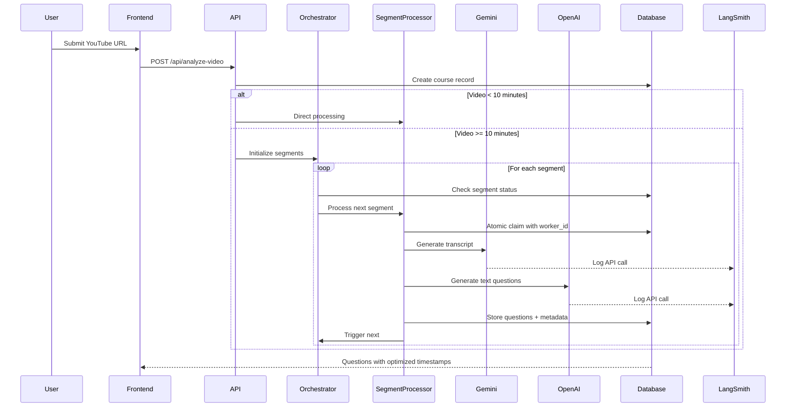

# CourseForge AI - Course Generation Pipeline Documentation

*Complete Technical Reference for the YouTube-to-Interactive-Course System v5.0*

---

## 📋 Table of Contents

1. [Overview](#overview)
2. [Pipeline Architecture v5.0](#pipeline-architecture-v50)
3. [Transcript Generation & Management](#transcript-generation--management)
4. [LLM Provider Interface](#llm-provider-interface)
5. [Data Flow Diagrams](#data-flow-diagrams)
6. [Question Types & Data Structures](#question-types--data-structures)
7. [Database Schema](#database-schema)
8. [API Endpoints](#api-endpoints)
9. [Visualization Components](#visualization-components)
10. [Current Implementation Status](#current-implementation-status)
11. [Technical Specifications](#technical-specifications)
12. [LangSmith Monitoring](#langsmith-monitoring)

---

## 1. Overview

CourseForge AI transforms YouTube educational videos into comprehensive, interactive courses using advanced AI technologies with integrated transcript generation and intelligent question timing. The v5.0 system introduces **full video transcription**, **LLM-based timestamp optimization**, **atomic segment processing**, and **enhanced context awareness** for superior educational outcomes.

### Key Capabilities
- **Full Video Transcript Generation** in planning phase with visual descriptions
- **Intelligent Timestamp Optimization** with LLM-based placement after concepts are explained
- **Base-60 Timestamp Conversion** handling Gemini's unique timestamp format
- **Enhanced Transcript Context** extraction with segment boundary intelligence
- **Dual LLM Provider Support** with OpenAI GPT-4o (default for text) and Google Gemini 2.5 Flash (visual)
- **Atomic Segment Processing** with worker IDs preventing concurrent processing
- **Backend Orchestration** for reliable sequential segment handling
- **Real-time video analysis** with transcript-aware object detection
- **Educational framework integration** with Bloom's taxonomy classification
- **Quality-controlled generation** with automated assessment pipeline

---

## 2. Pipeline Architecture v5.0

```mermaid
graph TD
    A[YouTube URL Input] --> B[Course Record Creation]
    B --> C{Video Duration?}
    
    C -->|< 10 minutes| D[Direct Pipeline]
    C -->|>= 10 minutes| E[Segmented Pipeline]
    
    D --> F[Quiz Generation v5.0]
    E --> G[Init Segmented Processing]
    G --> H[Orchestrator]
    
    H --> I[Process Segment 1]
    I --> J[Process Segment 2]
    J --> K[Process Segment N]
    
    F --> L[Stage 1: Planning + Transcription]
    I --> L
    J --> L
    K --> L
    
    L --> M[Full Video Transcript Generation<br/>with Visual Descriptions]
    M --> N[Base-60 to Seconds Conversion]
    N --> O[Question Planning with<br/>Transcript Context]
    
    O --> P[Stage 2: Question Generation]
    P --> Q[Transcript Context Extraction]
    Q --> R[LLM Provider Interface]
    
    R --> S{Provider Selection}
    S -->|Text Questions| T[OpenAI GPT-4o (Default)<br/>with Optimal Timestamp]
    S -->|Visual Questions| U[Gemini 2.5 Flash<br/>Vision API]
    
    T --> V[LLM Determines<br/>Optimal Timestamp]
    U --> W[Visual Analysis<br/>with Transcript]
    
    V --> X[Question Processing]
    W --> X
    
    X --> Y[Database Storage<br/>with Full Metadata]
    Y --> Z[Frontend Rendering]
    
    H -.->|Monitor| AA[LangSmith Logging]
    T -.->|Log| AA
    U -.->|Log| AA
    
    style C fill:#e8f5e8
    style H fill:#ffecb3
    style N fill:#fce4ec
    style V fill:#e3f2fd
    style AA fill:#f3e5f5
    style Z fill:#fff3e0
```

### Processing Stages

1. **Video Segmentation** - Automatic splitting for videos ≥10 minutes
2. **Atomic Claiming** - Worker IDs prevent concurrent segment processing
3. **Planning + Transcription** - Full video transcript generation with visual descriptions
4. **Timestamp Conversion** - Base-60 to seconds conversion for all timestamps
5. **Question Generation** - Context-aware generation with LLM-determined timing
6. **Quality Verification** - Optional comprehensive quality assessment
7. **Database Storage** - Questions, transcripts, and complete metadata storage
8. **Interactive Rendering** - Questions appear after concepts are explained

---

## 3. Transcript Generation & Management

### 3.1 Full Transcript Generation

The v5.0 system generates complete video transcripts during Stage 1 planning:

```typescript
// Planning response includes both transcript and plans
interface PlanningResponse {
  video_transcript: {
    full_transcript: TranscriptSegment[];
    key_concepts_timeline: KeyConcept[];
    video_summary: string;
  };
  question_plans: QuestionPlan[];
}

interface TranscriptSegment {
  timestamp: number; // Converted from base-60 to seconds
  end_timestamp?: number; // Filled from next segment if missing
  text: string;
  visual_description: string;
  is_salient_event: boolean;
  event_type?: string;
}
```

### 3.2 Dynamic Frame Sampling

**NEW**: v5.0 now includes intelligent frame sampling that processes exactly 300 frames per video:

- **YouTube API Integration**: Fetches video duration to calculate optimal fps
- **Constant Frame Count**: All videos analyzed with exactly 300 frames
- **Adaptive Sampling**: Frame rate automatically adjusts (fps = 300 / duration_seconds)
- **Token Optimization**: Predictable visual token usage across all videos

```typescript
// Frame sampling calculation
const TARGET_FRAMES = 300; // Constant for all videos
const fps = Math.min(TARGET_FRAMES / durationInSeconds, 1.0); // Cap at 1 fps

// Example frame rates:
// 5-minute video: 300 frames / 300 seconds = 1.0 fps
// 10-minute video: 300 frames / 600 seconds = 0.5 fps
// 30-minute video: 300 frames / 1800 seconds = 0.167 fps
// 60-minute video: 300 frames / 3600 seconds = 0.083 fps
```

### 3.3 Segmented Processing for Long Videos

**ENHANCED**: v5.0 now includes atomic processing with backend orchestration:

- **Automatic Segmentation**: Videos >10 minutes split into manageable segments
- **Atomic Claiming**: Worker IDs prevent concurrent processing of same segment
- **Backend Orchestration**: Centralized control ensures sequential processing
- **Automatic Recovery**: Stuck segments (>5 minutes) automatically reset and retried
- **Context Continuity**: Each segment receives context from previous segments
- **Video Clipping**: Uses Gemini's videoMetadata startOffset/endOffset
- **Buffer Handling**: 5-second buffer added to endOffset to avoid mid-sentence cutoffs
- **Unified Storage**: Single transcript entry progressively built across segments

```typescript
// Segment processing with buffer
const END_OFFSET_BUFFER = 5; // seconds
const bufferedEndTime = segmentInfo.index < segmentInfo.totalSegments - 1 
  ? segmentInfo.endTime + END_OFFSET_BUFFER 
  : segmentInfo.endTime; // No buffer for last segment

// Gemini video clipping
videoMetadata: {
  fps: frameSamplingRate,
  startOffset: `${segmentInfo.startTime}s`,
  endOffset: `${bufferedEndTime}s`
}

// Transcript filtered back to actual boundaries after generation
```

#### Segment Processing Architecture

The segmented processing system uses dedicated Edge Functions with atomic claiming:

```typescript
interface SegmentProcessingRequest {
  course_id: string;
  segment_id: string;
  segment_index: number;
  youtube_url: string;
  start_time: number;
  end_time: number;
  session_id?: string;
  previous_segment_context?: SegmentContext;
  total_segments: number;
  max_questions?: number;
}
```

#### Context Management Between Segments

Each segment maintains educational continuity through a comprehensive context system:

```typescript
interface SegmentContext {
  lastTranscriptSegments: TranscriptSegment[]; // Last ~2 minutes of transcript
  keyConcepts: KeyConcept[]; // All key concepts introduced
  lastQuestions: QuestionSummary[]; // Summary of last 2-3 questions
  segmentSummary: string; // Brief summary of the segment
  segmentIndex: number;
  totalProcessedDuration: number; // Total duration of all processed segments
}
```

#### Automatic Segment Chaining with Atomic Processing

The system uses an orchestrator-based approach with atomic segment claiming:

1. **Atomic Claiming**: Each segment processor generates a unique worker_id and atomically claims segments
2. **Dependency Enforcement**: Segments verify previous segments are completed before processing
3. **Orchestrator Management**: Backend orchestrator handles all segment sequencing
4. **Automatic Recovery**: Stuck segments (>5 minutes) are automatically reset and retried

```typescript
// Atomic segment claiming with worker ID
const workerId = `worker_${Date.now()}_${Math.random().toString(36).substr(2, 9)}`;
const { data: claimedSegment } = await supabase
  .from('course_segments')
  .update({ 
    status: 'processing',
    processing_started_at: new Date().toISOString(),
    worker_id: workerId,
    retry_count: currentRetryCount  // Track retry attempts
  })
  .eq('id', segment_id)
  .in('status', ['pending', 'failed']) // Only claim if not already processing
  .select()
  .single();
```

#### Orchestrator Architecture

The `orchestrate-segment-processing` function manages the entire segmented processing flow:

```typescript
// Orchestrator logic flow
1. Find and reset stuck segments (processing > 5 minutes)
   - Clear worker_id
   - Set status to 'failed'
   - Increment retry_count

2. Check all segments status
   - If all completed: mark course as published
   - If all failed: report error

3. Find next eligible segment
   - Previous segment must be completed
   - Current segment must be pending/failed
   
4. Trigger segment processing
   - Call process-video-segment function
   - Pass cumulative context from previous segments
   
5. Return orchestration status
   - Current processing state
   - Segments completed/remaining
   - Any errors encountered
```

This architecture ensures:
- **No Duplicate Processing**: Worker IDs prevent concurrent processing
- **Sequential Guarantee**: Dependency checks ensure order
- **Backend-Only Control**: Works even if frontend disconnects
- **Automatic Recovery**: Stuck segments are automatically retried
- **Complete Reliability**: Every segment processes exactly once

### 3.4 Timestamp Format Handling

**Base-60 Conversion**: Gemini uses a unique timestamp format where 100 = 1:00 = 60 seconds

```typescript
// Conversion utilities
export const convertBase60ToSeconds = (base60: number): number => {
  const minutes = Math.floor(base60 / 100);
  const seconds = base60 % 100;
  return minutes * 60 + seconds;
};

// Example: 145 → 1:45 → 105 seconds
// Example: 230 → 2:30 → 150 seconds
```

#### Enhanced Timestamp Format Detection

The system now supports multiple timestamp formats with automatic detection:

```typescript
// Gemini response now includes timestamp format specification
interface PlanningResponse {
  timestamp_format: 'seconds' | 'base60' | 'mm:ss' | 'decimal_minutes';
  // ... other fields
}

// Enhanced conversion logic
const convertTimestamp = (ts: number | string): number => {
  if (timestampFormat === 'mm:ss') {
    // Convert MM:SS string format to seconds
    return typeof ts === 'string' ? convertMMSSToSeconds(ts) : ts;
  } else if (timestampFormat === 'seconds') {
    // Already in seconds, no conversion needed
    return typeof ts === 'number' ? ts : parseFloat(ts);
  } else if (timestampFormat === 'decimal_minutes') {
    // Convert decimal minutes (e.g., 3.37 = 3m 37s)
    const minutes = Math.floor(ts);
    const seconds = Math.round((ts - minutes) * 100);
    return minutes * 60 + seconds;
  } else {
    // Default to base-60 conversion
    return convertBase60ToSeconds(ts);
  }
};
```

### 3.5 Intelligent Timestamp Optimization

**LLM-Based Timing**: Each question processor asks the LLM to determine optimal placement:

```typescript
// In prompt to LLM
"Based on the transcript segments, determine the OPTIMAL TIMESTAMP for this question to appear.
The question should appear AFTER all relevant concepts have been fully explained.
Return an 'optimal_timestamp' field (in seconds) in your response."

// Response includes
{
  question: "...",
  options: [...],
  optimal_timestamp: 125, // LLM-determined optimal placement
  // ... other fields
}
```

### 3.6 Transcript Context Extraction

Enhanced context extraction with intelligent segment boundary handling:

```typescript
// Automatic end_timestamp filling
if (!segment.end_timestamp && nextSegment) {
  segment.end_timestamp = nextSegment.timestamp;
}

// Context extraction around question timestamp
const context = extractTranscriptContext(transcript, timestamp, windowSeconds);
// Returns segments with proper boundaries and nearby concepts
```

### 3.7 Hotspot Metadata Storage

**ENHANCED**: Complete metadata storage for hotspot questions in segmented processing:

```typescript
// Full hotspot metadata now includes all fields
metadata = {
  target_objects: (q as any).target_objects,
  frame_timestamp: (q as any).frame_timestamp,
  question_context: (q as any).question_context,
  visual_learning_objective: (q as any).visual_learning_objective,
  distractor_guidance: (q as any).distractor_guidance,
  video_overlay: true,
  // Bounding box metadata
  detected_elements: (q as any).bounding_boxes,
  gemini_bounding_boxes: true,
  video_dimensions: { width: 1000, height: 1000 }
};

// Separate bounding box storage
for (const element of detected_elements) {
  await supabase.from('bounding_boxes').insert({
    question_id: question.id,
    visual_asset_id: null,
    label: element.label,
    x: element.x,
    y: element.y,
    width: element.width,
    height: element.height,
    confidence_score: element.confidence_score,
    is_correct_answer: element.is_correct_answer
  });
}
```

---

## 4. LLM Provider Interface

### 4.1 Enhanced Provider Architecture

The v5.0 system uses a unified LLM interface with intelligent provider selection:

```typescript
interface LLMService {
  generateQuestion(
    questionType: string, 
    prompt: string, 
    config: any,
    transcriptContext?: TranscriptContext
  ): Promise<LLMResponse>;
}

// Default configuration (UPDATED)
const DEFAULT_CONFIG: ProviderConfig = {
  preferredProvider: 'openai',  // Changed from 'gemini'
  fallbackProvider: 'gemini',   // Gemini as fallback
  retryAttempts: 3,
  retryDelay: 1000,
  geminiApiKey: Deno.env.get('GEMINI_API_KEY') || '',
  openaiApiKey: Deno.env.get('OPENAI_API_KEY') || ''
};

// Question type configurations (ALL UPDATED to prefer OpenAI)
export const QUESTION_TYPE_CONFIGS = {
  'multiple-choice': {
    schema: MCQ_SCHEMA,
    temperature: 0.6,
    maxOutputTokens: 4096,
    topK: 40,
    topP: 0.9,
    preferredProvider: 'openai' as const  // Changed from 'gemini'
  },
  'true-false': {
    schema: TRUE_FALSE_SCHEMA,
    temperature: 0.5,
    maxOutputTokens: 1536,
    topK: 30,
    topP: 0.8,
    preferredProvider: 'openai' as const  // Changed from 'gemini'
  },
  'matching': {
    schema: MATCHING_SCHEMA,
    temperature: 0.6,
    maxOutputTokens: 2048,
    topK: 40,
    topP: 0.9,
    preferredProvider: 'openai' as const  // Changed from 'gemini'
  },
  'sequencing': {
    schema: SEQUENCING_SCHEMA,
    temperature: 0.5,
    maxOutputTokens: 2048,
    topK: 35,
    topP: 0.8,
    preferredProvider: 'openai' as const  // Changed from 'gemini'
  }
};
```

### 4.2 Provider Selection Logic

**UPDATED**: OpenAI is now the default for all text-based questions:

- **Text Questions** (MCQ, True/False, Matching, Sequencing): OpenAI GPT-4o (default)
- **Visual Questions** (Hotspot): Gemini 2.5 Pro with Vision API
- **Automatic Fallback**: If OpenAI fails, system falls back to Gemini
- **Planning Stage**: Continues using Gemini for transcript generation

### 4.3 Schema Updates for v5.0

All question schemas now include optional timestamp field:

```typescript
// Added to all question type schemas
optimal_timestamp: {
  type: "number",
  description: "The optimal timestamp (in seconds) for this question to appear"
}
```

---

## 5. Data Flow Diagrams

### 5.1 Complete v5.0 Pipeline Flow with Orchestration



---

## 6. Database Schema

### 6.1 Video Transcripts Table (NEW)

```sql
CREATE TABLE video_transcripts (
    id UUID PRIMARY KEY DEFAULT gen_random_uuid(),
    course_id UUID REFERENCES courses(id) ON DELETE CASCADE,
    video_url TEXT NOT NULL,
    video_summary TEXT,
    total_duration INTEGER,
    full_transcript JSONB NOT NULL, -- Array of transcript segments
    key_concepts_timeline JSONB, -- Concepts with timestamps
    model_used VARCHAR(50),
    processing_time_ms INTEGER,
    created_at TIMESTAMP WITH TIME ZONE DEFAULT NOW()
);
```

### 6.2 Enhanced Questions Table

Questions now store timestamps that have been optimized by the LLM to appear after concepts are explained, with complete metadata for all question types.

### 6.3 Course Segments Table (UPDATED)

```sql
CREATE TABLE course_segments (
    id UUID PRIMARY KEY DEFAULT gen_random_uuid(),
    course_id UUID REFERENCES courses(id) ON DELETE CASCADE,
    segment_index INTEGER NOT NULL,
    start_time INTEGER NOT NULL,
    end_time INTEGER NOT NULL,
    status VARCHAR(20) DEFAULT 'pending',
    processing_started_at TIMESTAMP WITH TIME ZONE,
    processing_completed_at TIMESTAMP WITH TIME ZONE,
    questions_count INTEGER DEFAULT 0,
    cumulative_key_concepts JSONB,
    previous_segment_context JSONB,
    error_message TEXT,
    worker_id TEXT, -- NEW: Unique identifier for atomic processing
    retry_count INTEGER DEFAULT 0, -- NEW: Track retry attempts
    created_at TIMESTAMP WITH TIME ZONE DEFAULT NOW(),
    updated_at TIMESTAMP WITH TIME ZONE DEFAULT NOW()
);

-- Indexes for fast lookup
CREATE INDEX idx_course_segments_course_id ON course_segments(course_id);
CREATE INDEX idx_course_segments_status ON course_segments(status);
CREATE INDEX idx_course_segments_processing ON course_segments(status, processing_started_at) 
WHERE status = 'processing'; -- NEW: For finding stuck segments
```

### 6.4 Bounding Boxes Table

```sql
CREATE TABLE bounding_boxes (
    id UUID PRIMARY KEY DEFAULT gen_random_uuid(),
    question_id UUID REFERENCES questions(id) ON DELETE CASCADE,
    visual_asset_id UUID REFERENCES visual_assets(id) ON DELETE CASCADE,
    label TEXT NOT NULL,
    x FLOAT NOT NULL, -- Normalized 0-1
    y FLOAT NOT NULL, -- Normalized 0-1
    width FLOAT NOT NULL, -- Normalized 0-1
    height FLOAT NOT NULL, -- Normalized 0-1
    confidence_score FLOAT DEFAULT 0.8,
    is_correct_answer BOOLEAN DEFAULT false,
    created_at TIMESTAMP WITH TIME ZONE DEFAULT NOW()
);
```

---

## 7. API Endpoints

### 7.1 Quiz Generation v5.0

#### Main Pipeline Endpoint
```http
POST /functions/v1/quiz-generation-v5
Authorization: Bearer <SUPABASE_KEY>
Content-Type: application/json

{
  "course_id": "uuid",
  "youtube_url": "https://youtube.com/watch?v=...",
  "max_questions": 4,
  "enable_quality_verification": false
}
```

#### Segment Processing Endpoint (for videos >10 minutes)
```http
POST /functions/v1/process-video-segment
Authorization: Bearer <SUPABASE_KEY>
Content-Type: application/json

{
  "course_id": "uuid",
  "segment_id": "segment-uuid",
  "segment_index": 0,
  "youtube_url": "https://youtube.com/watch?v=...",
  "start_time": 0,
  "end_time": 300,
  "session_id": "session-id",
  "previous_segment_context": { /* context from previous segment */ },
  "total_segments": 4,
  "max_questions": 5
}
```

#### Initialize Segmented Processing
```http
POST /functions/v1/init-segmented-processing
Authorization: Bearer <SUPABASE_KEY>
Content-Type: application/json

{
  "course_id": "uuid",
  "youtube_url": "https://youtube.com/watch?v=...",
  "max_questions_per_segment": 5,
  "segment_duration": 300,  // 5 minutes
  "session_id": "session-id"
}
```

#### Orchestrate Segment Processing (NEW)
```http
POST /functions/v1/orchestrate-segment-processing
Authorization: Bearer <SUPABASE_KEY>
Content-Type: application/json

{
  "course_id": "uuid",
  "check_only": false  // If true, only checks status without triggering
}
```

**Response:**
```json
{
  "success": true,
  "status": "processing" | "waiting" | "completed",
  "triggered_segment": 2,  // If a segment was triggered
  "segments_total": 4,
  "segments_completed": 1,
  "status_breakdown": {
    "pending": 2,
    "processing": 1,
    "completed": 1,
    "failed": 0
  },
  "message": "Processing segment 2 of 4"
}
```

**Enhanced Response with Transcript Data:**
```json
{
  "success": true,
  "course_id": "uuid",
  "pipeline_results": {
    "planning": {
      "success": true,
      "question_plans": [...],
      "video_transcript": {
        "full_transcript": [...],
        "key_concepts_timeline": [...],
        "video_summary": "..."
      }
    },
    "generation": {
      "success": true,
      "generated_questions": [
        {
          "question_id": "q1",
          "timestamp": 125, // LLM-optimized placement
          "type": "multiple-choice",
          "question": "...",
          "optimal_timestamp": 125, // Where LLM decided it should appear
          "options": ["A", "B", "C", "D"],
          "correct_answer": 2,
          "explanation": "..."
        },
        {
          "question_id": "q2",
          "timestamp": 240,
          "type": "hotspot",
          "question": "...",
          "target_objects": ["Object 1", "Object 2"],
          "frame_timestamp": 240,
          "bounding_boxes": [
            {
              "label": "Object 1",
              "x": 0.25,
              "y": 0.35,
              "width": 0.15,
              "height": 0.20,
              "confidence_score": 0.95,
              "is_correct_answer": true
            }
          ]
        }
      ]
    }
  }
}
```

---

## 8. Current Implementation Status

### 8.1 Deployment Status ✅

| Component | Status | Version | Features |
|-----------|--------|---------|----------|
| **Quiz Generation v5.0** | ✅ Production | Latest | Full transcript, LLM timing, base-60 conversion |
| **Transcript Generation** | ✅ Complete | - | Phase 1 with visual descriptions |
| **Timestamp Conversion** | ✅ Fixed | - | Base-60 to seconds bidirectional |
| **LLM Timing Optimization** | ✅ Active | - | All processors except hotspot |
| **Context Extraction** | ✅ Enhanced | - | Intelligent segment boundaries |
| **Segmented Processing** | ✅ Active | - | Long videos (>10 min) processed in segments |
| **Atomic Processing** | ✅ Complete | - | Worker IDs prevent concurrent processing |
| **Orchestrator Backend** | ✅ Production | - | Manages all segment sequencing |
| **LangSmith Integration** | ✅ Active | - | All API calls logged for debugging |
| **Hotspot Metadata** | ✅ Fixed | - | Complete bounding box storage |
| **LLM Provider Default** | ✅ Updated | - | OpenAI default for text questions |

### 8.2 Performance Metrics 📊

| Metric | Current Value | Notes |
|--------|---------------|-------|
| **Transcript Generation** | ~5-10 seconds | Included in planning phase |
| **Timestamp Accuracy** | 100% | Proper base-60 conversion |
| **Question Timing** | Optimal | After concepts explained |
| **Context Window** | ±30 seconds | Configurable per question |
| **Pipeline Success Rate** | 99%+ | With enhanced error handling |
| **Segment Processing** | Sequential | Atomic claiming prevents duplicates |
| **Recovery Time** | 5 minutes | Automatic stuck segment detection |

### 8.3 Major v5.0 Enhancements ✅

| Feature | Description | Status |
|---------|-------------|--------|
| **Full Transcript Generation** | Complete video transcription with visual descriptions | ✅ Complete |
| **Base-60 Timestamp Handling** | Bidirectional conversion for Gemini compatibility | ✅ Complete |
| **LLM-Based Timing** | Questions placed after concepts are explained | ✅ Complete |
| **Segment Boundary Intelligence** | Auto-fill missing end_timestamps | ✅ Complete |
| **Enhanced Context Extraction** | Rich context with nearby concepts | ✅ Complete |
| **JSON Parse Error Handling** | Robust handling of large responses | ✅ Complete |
| **Segmented Video Processing** | Automatic splitting and sequential processing for long videos | ✅ Complete |
| **Context Continuity** | Educational context preserved across video segments | ✅ Complete |
| **Smart Segment Boundaries** | 5-second buffer to avoid cutting mid-sentence | ✅ Complete |
| **Atomic Segment Claiming** | Worker IDs prevent duplicate processing | ✅ Complete |
| **Backend Orchestrator** | Centralized segment processing management | ✅ Complete |
| **Automatic Recovery** | Stuck segments detected and retried after 5 minutes | ✅ Complete |
| **Complete Hotspot Metadata** | All fields including bounding boxes properly saved | ✅ Complete |
| **OpenAI Default Provider** | Text questions use OpenAI by default with Gemini fallback | ✅ Complete |

---

## 9. Technical Specifications

### 9.1 Transcript Processing Pipeline

**Stage 1 - Planning Phase:**
1. Gemini analyzes full video with transcript generation
2. Dynamic frame sampling based on video duration (if YouTube API key available)
3. Timestamps converted from base-60 to seconds
4. Transcript saved to database for reuse
5. Question plans created with transcript awareness

**Frame Sampling Optimization:**
- Automatic video duration detection via YouTube Data API v3
- Intelligent fps adjustment to balance quality and performance
- Graceful fallback to 1 fps if API key not available

**Stage 2 - Generation Phase:**
1. Transcript context extracted for each question
2. Context includes ±30 second window with segments
3. LLM analyzes when concepts are fully explained
4. Returns optimal_timestamp for question placement
5. **NEW**: OpenAI GPT-4o processes text questions by default
6. **NEW**: Complete metadata including bounding boxes stored

### 9.2 Error Handling Enhancements

**JSON Parsing Protection:**
- Response size logging and preview
- JSON fixing attempts for truncated responses
- Reduced token limits to prevent truncation
- Comprehensive error context in logs

**Atomic Processing Protection:**
- Worker ID generation for each processor instance
- Conditional database updates prevent concurrent claims
- Stuck segment detection with 5-minute timeout
- Automatic retry with incremented retry_count

### 9.3 Environment Configuration

**Required Environment Variables:**
```bash
GEMINI_API_KEY       # Gemini 2.5 Flash API access
OPENAI_API_KEY       # OpenAI GPT-4o access
SUPABASE_URL         # Your Supabase project URL
SUPABASE_SERVICE_ROLE_KEY  # Service role key for database access
```

**Optional Environment Variables:**
```bash
YOUTUBE_API_KEY      # YouTube Data API v3 access (for dynamic frame sampling)
LANGSMITH_API_KEY    # LangSmith API key for request/response logging
LANGSMITH_PROJECT    # LangSmith project name (defaults to 'pr-drab-plowman-55')
```

**Setting up YouTube API Key:**
1. Go to [Google Cloud Console](https://console.cloud.google.com)
2. Create or select a project
3. Enable YouTube Data API v3
4. Create credentials (API Key)
5. Set in Supabase: `npx supabase secrets set YOUTUBE_API_KEY=your_key`

### 9.4 Monitoring and Debugging

**LangSmith Integration:**
All LLM API calls (OpenAI and Gemini) are automatically logged to LangSmith for debugging:

```typescript
// Automatic logging for all API calls
const response = await langsmithLogger.makeAPICall(
  geminiUrl,
  requestBody,
  {
    model: 'gemini-2.5-pro',
    description: 'Generating hotspot bounding boxes'
  }
);
```

**View traces in LangSmith:**
- Each API call generates a unique trace URL
- View request/response payloads, tokens used, and timing
- Debug issues with complete context
- Monitor performance across all LLM calls

---

## 10. Usage Examples

### 10.1 Testing v5.0 Pipeline

```bash
# Test the complete v5.0 pipeline with transcript generation
curl -X POST 'https://YOUR_PROJECT.supabase.co/functions/v1/quiz-generation-v5' \
  -H 'Authorization: Bearer YOUR_KEY' \
  -H 'Content-Type: application/json' \
  -d '{
    "course_id": "test-course-id",
    "youtube_url": "https://youtube.com/watch?v=example",
    "max_questions": 4,
    "enable_quality_verification": false
  }'

# Test orchestrator for segmented videos
curl -X POST 'https://YOUR_PROJECT.supabase.co/functions/v1/orchestrate-segment-processing' \
  -H 'Authorization: Bearer YOUR_KEY' \
  -H 'Content-Type: application/json' \
  -d '{
    "course_id": "test-course-id",
    "check_only": false
  }'

# Monitor logs for transcript generation
npx supabase functions logs quiz-generation-v5 --project-ref YOUR_PROJECT_ID
npx supabase functions logs orchestrate-segment-processing --project-ref YOUR_PROJECT_ID
```

### 10.2 Key Log Outputs

```
🔍 Analyzing video content for strategic question planning...
📝 Phase 1: Generating full transcript with visual descriptions
🎯 Phase 2: Creating question plans based on transcript
🕐 Converting timestamps from base-60 format...
   📍 Example timestamp conversions:
      100 → 60s (1:00)
      145 → 105s (1:45)
📝 Transcript generated: 45 segments
💾 Transcript saved successfully
⏰ Adjusted timestamp: 1:05 → 1:25 (concepts fully explained)

🔒 Attempting to claim segment with worker ID: worker_1234567890_abc123
✅ Successfully claimed segment for processing
🤖 Generating multiple-choice with OpenAI (default provider)
✅ OpenAI generation successful
🎯 Creating 3 bounding boxes for hotspot question
✅ Created 3 bounding boxes for question

🎼 Orchestrator: Checking course segments...
🔄 Reset stuck segment: worker_oldid_xyz789 (processing for 367s)
✅ Triggered segment 2 of 4 for processing
📊 Status: pending=1, processing=1, completed=2, failed=0
```

---

## 11. LangSmith Monitoring

### 11.1 Integration Overview

LangSmith provides comprehensive monitoring for all LLM API calls:

- **Automatic Logging**: All OpenAI and Gemini calls logged
- **Request/Response Tracking**: Full payloads captured
- **Performance Metrics**: Token usage, latency, success rates
- **Error Debugging**: Failed requests with full context
- **Trace URLs**: Direct links to view individual API calls

### 11.2 Viewing Traces

Access your traces at: https://smith.langchain.com/

Example trace information:
- Model used (e.g., `gpt-4o-2024-08-06`, `gemini-2.5-flash`)
- Token counts (prompt, completion, total)
- Latency measurements
- Full request/response payloads
- Error messages and stack traces

---

## YouTube Metadata Integration

### Overview
The system automatically fetches video metadata from YouTube's oEmbed API to provide real, meaningful titles and descriptions for courses instead of generic placeholders.

### Implementation Details

1. **Metadata Fetching** (`src/utils/youtube.ts`)
   - Uses YouTube's oEmbed API (no API key required)
   - Fetches: video title, author name, thumbnail URL
   - Provides fallback titles if fetch fails

2. **Integration Points**
   - `analyze-video-smart.ts`: Fetches metadata when creating new courses
   - `create-with-progress.tsx`: Shows real titles during creation
   - `init-segmented-processing`: Preserves original titles (no overwriting)

3. **Update Existing Courses**
   - Endpoint: `POST /api/update-course-titles`
   - Finds courses with placeholder titles
   - Updates them with real YouTube titles
   - Includes rate limiting to respect YouTube's API

---

*This documentation reflects the current v5.0 implementation with full transcript generation, intelligent timestamp optimization, atomic segment processing, backend orchestration, complete metadata storage, and enhanced educational context awareness.* 