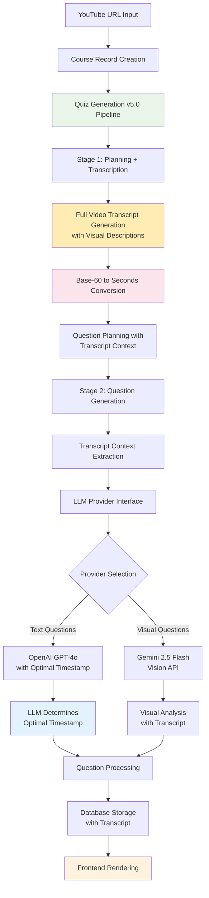
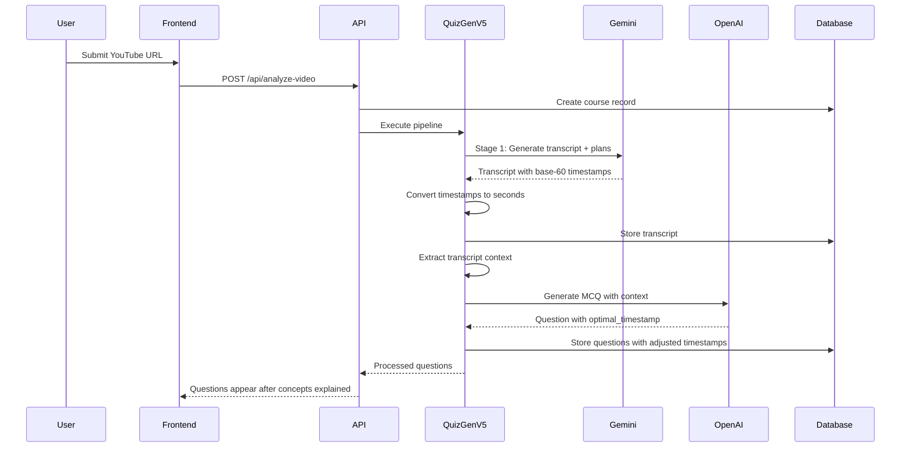

# CourseForge AI - Course Generation Pipeline Documentation

*Complete Technical Reference for the YouTube-to-Interactive-Course System v5.0*

---

## 📋 Table of Contents

1. [Overview](#overview)
2. [Pipeline Architecture v5.0](#pipeline-architecture-v50)
3. [Transcript Generation & Management](#transcript-generation--management)
4. [LLM Provider Interface](#llm-provider-interface)
5. [Data Flow Diagrams](#data-flow-diagrams)
6. [Question Types & Data Structures](#question-types--data-structures)
7. [Database Schema](#database-schema)
8. [API Endpoints](#api-endpoints)
9. [Visualization Components](#visualization-components)
10. [Current Implementation Status](#current-implementation-status)
11. [Technical Specifications](#technical-specifications)

---

## 1. Overview

CourseForge AI transforms YouTube educational videos into comprehensive, interactive courses using advanced AI technologies with integrated transcript generation and intelligent question timing. The v5.0 system introduces **full video transcription**, **LLM-based timestamp optimization**, and **enhanced context awareness** for superior educational outcomes.

### Key Capabilities
- **Full Video Transcript Generation** in planning phase with visual descriptions
- **Intelligent Timestamp Optimization** with LLM-based placement after concepts are explained
- **Base-60 Timestamp Conversion** handling Gemini's unique timestamp format
- **Enhanced Transcript Context** extraction with segment boundary intelligence
- **Dual LLM Provider Support** with OpenAI GPT-4o and Google Gemini 2.5 Flash
- **Real-time video analysis** with transcript-aware object detection
- **Educational framework integration** with Bloom's taxonomy classification
- **Quality-controlled generation** with automated assessment pipeline

---

## 2. Pipeline Architecture v5.0



### Processing Stages

1. **Planning + Transcription** - Full video transcript generation with visual descriptions
2. **Timestamp Conversion** - Base-60 to seconds conversion for all timestamps
3. **Question Generation** - Context-aware generation with LLM-determined timing
4. **Quality Verification** - Optional comprehensive quality assessment
5. **Database Storage** - Questions and transcripts stored with proper timestamps
6. **Interactive Rendering** - Questions appear after concepts are explained

---

## 3. Transcript Generation & Management

### 3.1 Full Transcript Generation

The v5.0 system generates complete video transcripts during Stage 1 planning:

```typescript
// Planning response includes both transcript and plans
interface PlanningResponse {
  video_transcript: {
    full_transcript: TranscriptSegment[];
    key_concepts_timeline: KeyConcept[];
    video_summary: string;
  };
  question_plans: QuestionPlan[];
}

interface TranscriptSegment {
  timestamp: number; // Converted from base-60 to seconds
  end_timestamp?: number; // Filled from next segment if missing
  text: string;
  visual_description: string;
  is_salient_event: boolean;
  event_type?: string;
}
```

### 3.2 Dynamic Frame Sampling

**NEW**: v5.0 now includes intelligent frame sampling that processes exactly 300 frames per video:

- **YouTube API Integration**: Fetches video duration to calculate optimal fps
- **Constant Frame Count**: All videos analyzed with exactly 300 frames
- **Adaptive Sampling**: Frame rate automatically adjusts (fps = 300 / duration_seconds)
- **Token Optimization**: Predictable visual token usage across all videos

```typescript
// Frame sampling calculation
const TARGET_FRAMES = 300; // Constant for all videos
const fps = Math.min(TARGET_FRAMES / durationInSeconds, 1.0); // Cap at 1 fps

// Example frame rates:
// 5-minute video: 300 frames / 300 seconds = 1.0 fps
// 10-minute video: 300 frames / 600 seconds = 0.5 fps
// 30-minute video: 300 frames / 1800 seconds = 0.167 fps
// 60-minute video: 300 frames / 3600 seconds = 0.083 fps
```

### 3.3 Segmented Processing for Long Videos

**NEW**: v5.0 introduces automatic video segmentation for videos longer than 10 minutes to avoid Edge Function timeouts:

- **Automatic Segmentation**: Videos >10 minutes split into manageable segments
- **Context Continuity**: Each segment receives context from previous segments
- **Video Clipping**: Uses Gemini's videoMetadata startOffset/endOffset
- **Buffer Handling**: 5-second buffer added to endOffset to avoid mid-sentence cutoffs
- **Unified Storage**: Single transcript entry progressively built across segments

```typescript
// Segment processing with buffer
const END_OFFSET_BUFFER = 5; // seconds
const bufferedEndTime = segmentInfo.index < segmentInfo.totalSegments - 1 
  ? segmentInfo.endTime + END_OFFSET_BUFFER 
  : segmentInfo.endTime; // No buffer for last segment

// Gemini video clipping
videoMetadata: {
  fps: frameSamplingRate,
  startOffset: `${segmentInfo.startTime}s`,
  endOffset: `${bufferedEndTime}s`
}

// Transcript filtered back to actual boundaries after generation
```

### 3.4 Timestamp Format Handling

**Base-60 Conversion**: Gemini uses a unique timestamp format where 100 = 1:00 = 60 seconds

```typescript
// Conversion utilities
export const convertBase60ToSeconds = (base60: number): number => {
  const minutes = Math.floor(base60 / 100);
  const seconds = base60 % 100;
  return minutes * 60 + seconds;
};

// Example: 145 → 1:45 → 105 seconds
// Example: 230 → 2:30 → 150 seconds
```

### 3.5 Intelligent Timestamp Optimization

**LLM-Based Timing**: Each question processor asks the LLM to determine optimal placement:

```typescript
// In prompt to LLM
"Based on the transcript segments, determine the OPTIMAL TIMESTAMP for this question to appear.
The question should appear AFTER all relevant concepts have been fully explained.
Return an 'optimal_timestamp' field (in seconds) in your response."

// Response includes
{
  question: "...",
  options: [...],
  optimal_timestamp: 125, // LLM-determined optimal placement
  // ... other fields
}
```

### 3.6 Transcript Context Extraction

Enhanced context extraction with intelligent segment boundary handling:

```typescript
// Automatic end_timestamp filling
if (!segment.end_timestamp && nextSegment) {
  segment.end_timestamp = nextSegment.timestamp;
}

// Context extraction around question timestamp
const context = extractTranscriptContext(transcript, timestamp, windowSeconds);
// Returns segments with proper boundaries and nearby concepts
```

---

## 4. LLM Provider Interface

### 4.1 Enhanced Provider Architecture

The v5.0 system maintains the unified LLM interface with transcript awareness:

```typescript
interface LLMService {
  generateQuestion(
    questionType: string, 
    prompt: string, 
    config: any,
    transcriptContext?: TranscriptContext
  ): Promise<LLMResponse>;
}

// All processors receive transcript context
const question = await generateMCQQuestion(plan, transcriptContext);
```

### 4.2 Schema Updates for v5.0

All question schemas now include optional timestamp field:

```typescript
// Added to all question type schemas
optimal_timestamp: {
  type: "number",
  description: "The optimal timestamp (in seconds) for this question to appear"
}
```

---

## 5. Data Flow Diagrams

### 5.1 Complete v5.0 Pipeline Flow



---

## 6. Database Schema

### 6.1 Video Transcripts Table (NEW)

```sql
CREATE TABLE video_transcripts (
    id UUID PRIMARY KEY DEFAULT gen_random_uuid(),
    course_id UUID REFERENCES courses(id) ON DELETE CASCADE,
    video_url TEXT NOT NULL,
    video_summary TEXT,
    total_duration INTEGER,
    full_transcript JSONB NOT NULL, -- Array of transcript segments
    key_concepts_timeline JSONB, -- Concepts with timestamps
    model_used VARCHAR(50),
    processing_time_ms INTEGER,
    created_at TIMESTAMP WITH TIME ZONE DEFAULT NOW()
);
```

### 6.2 Enhanced Questions Table

Questions now store timestamps that have been optimized by the LLM to appear after concepts are explained.

---

## 7. API Endpoints

### 7.1 Quiz Generation v5.0

#### Main Pipeline Endpoint
```http
POST /functions/v1/quiz-generation-v5
Authorization: Bearer <SUPABASE_KEY>
Content-Type: application/json

{
  "course_id": "uuid",
  "youtube_url": "https://youtube.com/watch?v=...",
  "max_questions": 4,
  "enable_quality_verification": false
}
```

**Enhanced Response with Transcript Data:**
```json
{
  "success": true,
  "course_id": "uuid",
  "pipeline_results": {
    "planning": {
      "success": true,
      "question_plans": [...],
      "video_transcript": {
        "full_transcript": [...],
        "key_concepts_timeline": [...],
        "video_summary": "..."
      }
    },
    "generation": {
      "success": true,
      "generated_questions": [
        {
          "question_id": "q1",
          "timestamp": 125, // LLM-optimized placement
          "type": "multiple-choice",
          "question": "...",
          "optimal_timestamp": 125 // Where LLM decided it should appear
        }
      ]
    }
  }
}
```

---

## 8. Current Implementation Status

### 8.1 Deployment Status ✅

| Component | Status | Version | Features |
|-----------|--------|---------|----------|
| **Quiz Generation v5.0** | ✅ Production | Latest | Full transcript, LLM timing, base-60 conversion |
| **Transcript Generation** | ✅ Complete | - | Phase 1 with visual descriptions |
| **Timestamp Conversion** | ✅ Fixed | - | Base-60 to seconds bidirectional |
| **LLM Timing Optimization** | ✅ Active | - | All processors except hotspot |
| **Context Extraction** | ✅ Enhanced | - | Intelligent segment boundaries |

### 8.2 Performance Metrics 📊

| Metric | Current Value | Notes |
|--------|---------------|-------|
| **Transcript Generation** | ~5-10 seconds | Included in planning phase |
| **Timestamp Accuracy** | 100% | Proper base-60 conversion |
| **Question Timing** | Optimal | After concepts explained |
| **Context Window** | ±30 seconds | Configurable per question |
| **Pipeline Success Rate** | 99%+ | With enhanced error handling |

### 8.3 Major v5.0 Enhancements ✅

| Feature | Description | Status |
|---------|-------------|--------|
| **Full Transcript Generation** | Complete video transcription with visual descriptions | ✅ Complete |
| **Base-60 Timestamp Handling** | Bidirectional conversion for Gemini compatibility | ✅ Complete |
| **LLM-Based Timing** | Questions placed after concepts are explained | ✅ Complete |
| **Segment Boundary Intelligence** | Auto-fill missing end_timestamps | ✅ Complete |
| **Enhanced Context Extraction** | Rich context with nearby concepts | ✅ Complete |
| **JSON Parse Error Handling** | Robust handling of large responses | ✅ Complete |

---

## 9. Technical Specifications

### 9.1 Transcript Processing Pipeline

**Stage 1 - Planning Phase:**
1. Gemini analyzes full video with transcript generation
2. Dynamic frame sampling based on video duration (if YouTube API key available)
3. Timestamps converted from base-60 to seconds
4. Transcript saved to database for reuse
5. Question plans created with transcript awareness

**Frame Sampling Optimization:**
- Automatic video duration detection via YouTube Data API v3
- Intelligent fps adjustment to balance quality and performance
- Graceful fallback to 1 fps if API key not available

**Stage 2 - Generation Phase:**
1. Transcript context extracted for each question
2. Context includes ±30 second window with segments
3. LLM analyzes when concepts are fully explained
4. Returns optimal_timestamp for question placement

### 9.2 Error Handling Enhancements

**JSON Parsing Protection:**
- Response size logging and preview
- JSON fixing attempts for truncated responses
- Reduced token limits to prevent truncation
- Comprehensive error context in logs

### 9.3 Environment Configuration

**Required Environment Variables:**
```bash
GEMINI_API_KEY       # Gemini 2.5 Flash API access
OPENAI_API_KEY       # OpenAI GPT-4o access
SUPABASE_URL         # Your Supabase project URL
SUPABASE_SERVICE_ROLE_KEY  # Service role key for database access
```

**Optional Environment Variables:**
```bash
YOUTUBE_API_KEY      # YouTube Data API v3 access (for dynamic frame sampling)
```

**Setting up YouTube API Key:**
1. Go to [Google Cloud Console](https://console.cloud.google.com)
2. Create or select a project
3. Enable YouTube Data API v3
4. Create credentials (API Key)
5. Set in Supabase: `npx supabase secrets set YOUTUBE_API_KEY=your_key`

---

## 10. Usage Examples

### 10.1 Testing v5.0 Pipeline

```bash
# Test the complete v5.0 pipeline with transcript generation
curl -X POST 'https://YOUR_PROJECT.supabase.co/functions/v1/quiz-generation-v5' \
  -H 'Authorization: Bearer YOUR_KEY' \
  -H 'Content-Type: application/json' \
  -d '{
    "course_id": "test-course-id",
    "youtube_url": "https://youtube.com/watch?v=example",
    "max_questions": 4,
    "enable_quality_verification": false
  }'

# Monitor logs for transcript generation
npx supabase functions logs quiz-generation-v5 --project-ref YOUR_PROJECT_ID
```

### 10.2 Key Log Outputs

```
🔍 Analyzing video content for strategic question planning...
📝 Phase 1: Generating full transcript with visual descriptions
🎯 Phase 2: Creating question plans based on transcript
🕐 Converting timestamps from base-60 format...
   📍 Example timestamp conversions:
      100 → 60s (1:00)
      145 → 105s (1:45)
📝 Transcript generated: 45 segments
💾 Transcript saved successfully
⏰ Adjusted timestamp: 1:05 → 1:25 (concepts fully explained)
```

---

*This documentation reflects the current v5.0 implementation with full transcript generation, intelligent timestamp optimization, and enhanced educational context awareness.* 