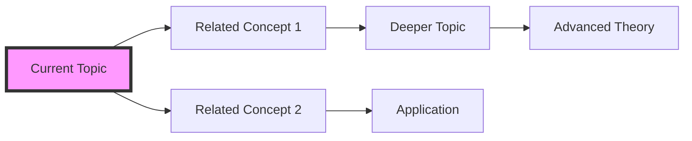

# Additional AI Chat Assistant Enhancement Ideas

## Beyond Visual Generation: Comprehensive Learning Support

### 1. Interactive Code Execution

**Concept**: Allow students to write and execute code snippets directly in the chat.

```typescript
interface CodeExecutionFeature {
  supportedLanguages: ['python', 'javascript', 'sql', 'r'];
  capabilities: {
    runCode: boolean;
    debugging: boolean;
    stepThrough: boolean;
    visualizeExecution: boolean;
  };
}
```

**Benefits**:
- Immediate hands-on practice
- Learn by doing, not just reading
- Debug code with AI guidance
- Visualize execution flow

### 2. Socratic Learning Mode

**Concept**: AI guides students to discover answers through questions rather than direct explanations.

**Implementation**:
```typescript
interface SocraticMode {
  questioningStrategies: [
    'clarifying_assumptions',
    'exploring_evidence',
    'examining_viewpoints',
    'probing_implications',
    'questioning_questions'
  ];
  adaptiveDifficulty: boolean;
  hintProgression: 'subtle' | 'moderate' | 'explicit';
}
```

**Example Interaction**:
- Student: "Why does this algorithm fail?"
- AI: "What assumptions does the algorithm make about the input? Have you considered what happens when..."

### 3. Adaptive Quiz Generation

**Concept**: Generate personalized quiz questions based on chat interactions.

**Features**:
- Questions target concepts discussed in chat
- Difficulty adapts to demonstrated understanding
- Immediate feedback with visual explanations
- Progress tracking across sessions

### 4. Voice Interaction & Pronunciation

**For Language Learning**:
- Speech-to-text for pronunciation practice
- AI feedback on accent and intonation
- Audio explanations for better retention
- Multilingual support

### 5. Collaborative Learning Spaces

**Concept**: Enable multiple students to interact with AI together.

```typescript
interface CollaborativeSession {
  participants: User[];
  sharedContext: {
    transcript: TranscriptSegment[];
    chatHistory: ChatMessage[];
    diagrams: VisualContent[];
  };
  features: {
    peerQuestions: boolean;
    groupProblemSolving: boolean;
    roleBasedDiscussion: boolean;
  };
}
```

### 6. Emotion-Aware Responses

**Concept**: Detect learning frustration or confusion and adapt responses.

**Detection Signals**:
- Repeated questions on same topic
- Language indicating frustration
- Long pauses or abandonment
- Error patterns

**Adaptive Responses**:
- Encouragement when struggling
- Break down complex topics more
- Suggest breaks or different approaches
- Celebrate progress and victories

### 7. AR/VR Integration

**Concept**: Extend chat into immersive environments.

**Applications**:
- 3D molecular structures in chemistry
- Historical site tours
- Physics simulations
- Anatomical models

### 8. Knowledge Graph Navigation

**Concept**: Visualize and navigate through connected concepts.



**Features**:
- Click to explore related topics
- See learning path progression
- Identify knowledge gaps
- Suggest next topics

### 9. Study Buddy Personas

**Concept**: AI adopts different teaching personas based on learning preferences.

**Personas**:
- **The Professor**: Formal, detailed explanations
- **The Peer Tutor**: Casual, relatable examples
- **The Coach**: Motivational, goal-oriented
- **The Debugger**: Technical, problem-solving focused

### 10. Time-Spaced Review System

**Concept**: AI reminds students to review concepts at optimal intervals.

**Implementation**:
- Track when concepts were first learned
- Use spaced repetition algorithms
- Send review prompts via chat
- Adapt intervals based on quiz performance

### 11. Real-World Application Connector

**Concept**: Connect abstract concepts to real-world applications.

**Features**:
- Industry use cases
- Current news connections
- Career path relevance
- Project idea generation

### 12. Peer Learning Integration

**Concept**: Connect students learning similar topics.

```typescript
interface PeerLearning {
  matchingCriteria: {
    topic: string;
    level: 'beginner' | 'intermediate' | 'advanced';
    learningStyle: string[];
    timezone: string;
  };
  interactionTypes: [
    'study_sessions',
    'concept_explanation',
    'problem_solving',
    'project_collaboration'
  ];
}
```

### 13. Gamification Elements

**Concept**: Add game-like elements to increase engagement.

**Features**:
- XP for asking good questions
- Badges for concept mastery
- Learning streaks
- Leaderboards (optional)
- Unlock advanced topics

### 14. Meta-Learning Support

**Concept**: Teach students how to learn effectively.

**Topics**:
- Study technique recommendations
- Time management tips
- Note-taking strategies
- Memory techniques
- Focus optimization

### 15. API Integration Hub

**Concept**: Connect to external learning resources.

**Integrations**:
- Wikipedia for quick facts
- ArXiv for research papers
- GitHub for code examples
- YouTube for supplementary videos
- Stack Overflow for programming help

## Implementation Priority Matrix

| Feature | Impact | Effort | Priority |
|---------|---------|--------|----------|
| Code Execution | High | Medium | 1 |
| Socratic Mode | High | Low | 1 |
| Adaptive Quizzes | High | Medium | 2 |
| Knowledge Graph | Medium | High | 3 |
| Voice Interaction | Medium | High | 4 |
| AR/VR | High | Very High | 5 |

## Conclusion

These enhancements would transform the AI chat assistant into a comprehensive learning companion that:

1. **Adapts to individual learning styles** through multiple interaction modes
2. **Provides hands-on practice** with code execution and simulations
3. **Builds metacognitive skills** through Socratic questioning
4. **Creates social learning opportunities** via collaboration features
5. **Maintains engagement** through gamification and emotional awareness

The key is to implement these features progressively, starting with high-impact, low-effort enhancements and building towards more complex capabilities based on user feedback and engagement data. 