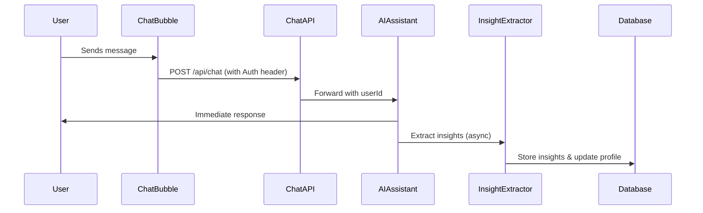
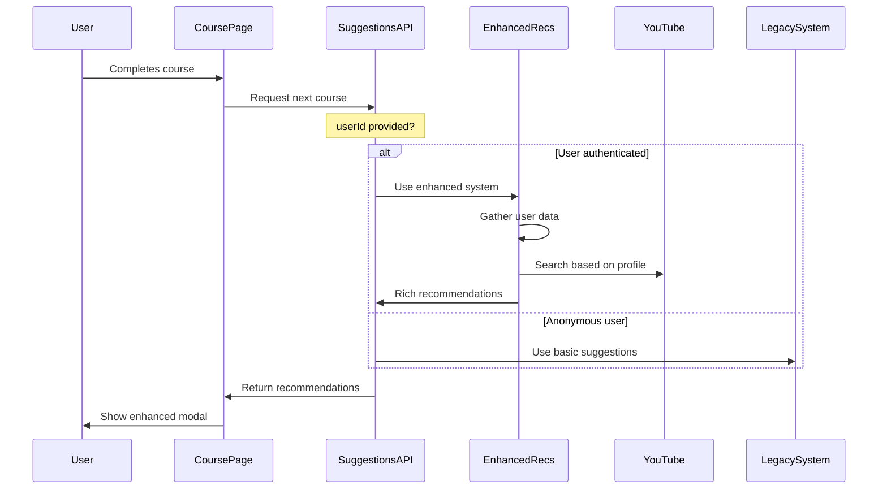

# Enhanced Recommendations Frontend Integration

## Overview

The enhanced recommendations system is **fully implemented in the backend** with **Algorithm v4.1** and **UI has been updated** to display personalized reasoning. This document explains how the system connects to the frontend and the current implementation status.

### Latest v4.1 Improvements
- **Automatic Profile Initialization**: New users get comprehensive profiles from existing data
- **Enhanced Wrong Answer Analysis**: Shows all options with user selections
- **Dynamic Profile Evolution**: Weighted updates based on maturity (15-35%)
- **Performance Verification**: Chat insights validated against quiz results
- **Improved Duration Preferences**: 3-15 minutes ideal, <10 min optimal

## Current Implementation Status

### ✅ Backend Complete
- **Edge Function**: `enhanced-recommendations` fully implemented with:
  - AI chat insight extraction
  - User learning profiles
  - Wrong question analysis
  - LLM-powered YouTube search
  - Personalized recommendation generation
  - LangSmith monitoring

### ✅ API Layer Updated
- **`/api/course/suggestions.ts`**: Now supports enhanced recommendations when `userId` is provided
- **`/api/chat.ts`**: Extracts `userId` from authorization header and passes to edge function

### ✅ Frontend Updated
- **Course Page**: Updated to pass `userId`, `courseId`, and `trigger` to suggestions API
- **Chat Bubble**: Updated to include authorization headers for authenticated users
- **Next Course Modal**: Now displays enhanced recommendation data with reasoning

## How It Works

### 1. Chat Insight Extraction (Background Process)


### 2. Course Completion & Recommendations


## When Recommendations Are Triggered

1. **Course Completion Modal** (Primary)
   - Automatically shown 3 seconds before video ends
   - User clicks "Generate Next Course" button
   - Location: `src/pages/course/[id].tsx` → `fetchNextCourse()`

2. **Manual Request**
   - "Generate Next Course" button in video player header
   - Available throughout the course

## Data Flow

### Input Data (What Enhanced System Uses)
- **User ID**: From authentication context
- **Current Course ID**: The course being completed
- **Wrong Questions**: Enhanced analysis includes:
  - Full question text and type
  - All answer options (parsed from JSON if needed)
  - User's selected answer (text or index)
  - Correct answer with explanation
  - Concepts extracted from explanations
- **Chat Insights**: Last 50 conversations analyzed for:
  - Struggling concepts (cross-referenced with performance)
  - Learning preferences with percentage scores
  - Topic interests with dynamic weighting
  - Engagement patterns and emotional indicators
- **Performance Data**: Last 100 question responses with:
  - Accuracy by question type
  - Response time patterns
  - Recent performance trends
- **Course History**: Previously completed courses with:
  - Completion percentages
  - Questions answered per course
  - Time spent patterns
- **User Learning Profile**: Comprehensive profile including:
  - Learning styles (visual, sequential, etc.) with scores
  - Difficulty preferences (beginner/intermediate/advanced)
  - Struggling vs mastered concepts
  - Session behavior patterns
  - Profile confidence score

### Output Data (What Frontend Receives)
```typescript
interface EnhancedRecommendation {
  // Basic fields (backward compatible)
  topic: string;
  video: string;
  
  // Enhanced fields (new)
  description: string;
  reasons: string[];           // Why this video was chosen
  difficulty_match: string;    // 'perfect', 'challenging', etc.
  addresses_mistakes: string[]; // Which wrong answers it helps with
  thumbnail_url: string;
  channel_name: string;
  duration: string;
}
```

## Current UI Implementation

### ✅ Enhanced Next Course Modal
The modal now displays:

1. **Course Title & Description** - Basic information about the next course
2. **"Why this course?" Section** - Personalized reasons with checkmarks:
   - Based on learning style
   - Addresses struggled concepts
   - Matches difficulty level
3. **"Helps with:" Section** - Orange highlight box showing which mistakes it addresses
4. **Video Metadata** - Channel name, duration, and difficulty badge:
   - ✓ Perfect match (green)
   - Challenging (gray)
   - Review (outline)
   - Advanced (outline)

### Example Display
```
┌─────────────────────────────────────────┐
│ 🎉 Course Complete!                     │
│                                         │
│ Up Next:                                │
│ [Course Title]                          │
│ [Description]                           │
│                                         │
│ Why this course?                        │
│ ✓ Matches your visual learning style    │
│ ✓ Helps with matrix multiplication      │
│ ✓ Recommended difficulty level          │
│                                         │
│ [Helps with: Vector operations, ...]    │
│                                         │
│ 3Blue1Brown • 15:24 • ✓ Perfect match  │
│                                         │
│ • Interactive questions generated       │
│                                         │
│ [Start Next Course] [Stay Here]         │
└─────────────────────────────────────────┘
```

## What's Next

### 1. Multiple Recommendations UI
Currently, the system returns 5 recommendations but the UI only shows 1. Consider:
- Carousel of recommendations
- List view with all options
- "Show more suggestions" button

### 2. Analytics Integration
Track which recommendations users select to improve the system:
```typescript
// When user selects a recommendation
trackRecommendationSelection({
  recommendationId: nextCourse.id,
  position: 0, // Which position it was shown in
  reasons: nextCourse.reasons,
  trigger: 'course_completion'
});
```

### 3. Learning Dashboard
Future enhancement to show:
- User learning profile visualization
- Recommendation history
- Progress over time

## Testing the Integration

### 1. Verify Chat Insights are Being Extracted
```sql
-- Check if insights are being stored
SELECT * FROM chat_insights 
WHERE user_id = 'YOUR_USER_ID' 
ORDER BY created_at DESC;

-- Check if profile is being updated
SELECT * FROM user_learning_profiles 
WHERE user_id = 'YOUR_USER_ID';
```

### 2. Test Enhanced Recommendations
```bash
# Use the test script
node scripts/test-enhanced-recommendations.js YOUR_USER_ID YOUR_COURSE_ID
```

### 3. Monitor in LangSmith
- Project: `enhanced-recommendations`
- Look for traces with metadata showing wrong questions and user profile data

## Environment Variables Required
```env
# For enhanced recommendations
SERPAPI_API_KEY=your_serpapi_key
LANGSMITH_API_KEY=your_langsmith_key

# Standard Supabase
SUPABASE_URL=your_supabase_url
SUPABASE_SERVICE_ROLE_KEY=your_service_role_key
```

## Monitoring & Debugging

### Check if Enhanced System is Being Used
Look for console logs:
```
🎯 Using enhanced recommendations for user: [userId]
```

### Verify Data Flow
1. Chat API should log: `👤 Authenticated user: [userId]`
2. Suggestions API should receive `userId` in request body
3. Enhanced recommendations should return `reasons` and `addresses_mistakes`
4. Next Course Modal should display reasoning sections

### Common Issues
- **No userId**: User not authenticated or session expired
- **No insights**: User hasn't used chat yet
- **Basic recommendations**: Check if `userId` is being passed correctly
- **No reasons displayed**: Check if `firstTopic.reasons` is populated in response 