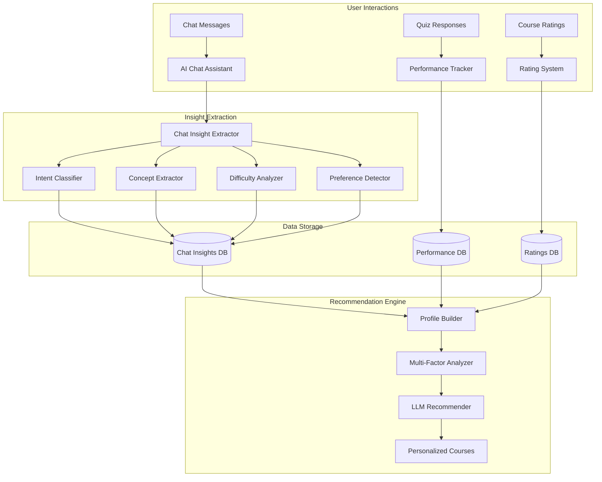
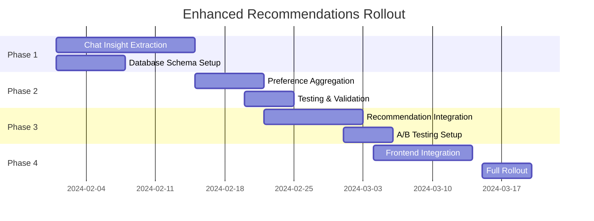

# Enhanced Course Recommendations with AI Chat Insights

## Table of Contents
1. [Overview](#overview)
2. [System Architecture](#system-architecture)
3. [Chat Insight Extraction Pipeline](#chat-insight-extraction-pipeline)
4. [Database Schema Design](#database-schema-design)
5. [Implementation Phases](#implementation-phases)
6. [API Specifications](#api-specifications)
7. [Frontend Integration](#frontend-integration)
8. [Testing & Validation](#testing--validation)
9. [Migration Strategy](#migration-strategy)

## Overview

This document outlines the implementation plan for enhancing the course recommendation system by incorporating insights from AI chat assistant conversations. The system will analyze user interactions to understand learning preferences, difficulties, and interests, creating a more personalized learning experience.

### Key Objectives
- Extract meaningful insights from chat conversations in real-time
- Persist user learning preferences and difficulties
- Create a comprehensive user learning profile
- Integrate chat insights with performance data for better recommendations
- Provide transparent, explainable recommendations

## System Architecture

### High-Level Flow



## Chat Insight Extraction Pipeline

### 1. Real-time Insight Extraction

```typescript
interface ChatInsightExtractor {
  async extractInsights(
    message: string,
    response: string,
    context: ChatContext
  ): Promise<ExtractedInsights>;
}

interface ExtractedInsights {
  // Learning difficulties
  strugglingConcepts: ConceptDifficulty[];
  confusionPoints: string[];
  
  // Learning preferences
  learningStyle: LearningStyleIndicator[];
  preferredExplanationDepth: 'brief' | 'detailed' | 'step-by-step';
  
  // Interests and goals
  expressedInterests: string[];
  learningGoals: string[];
  
  // Engagement patterns
  questionTypes: QuestionType[];
  engagementLevel: number; // 0-1 scale
  
  // Meta information
  timestamp: Date;
  confidence: number;
}
```

### 2. Intent Classification System

```typescript
enum ChatIntent {
  // Knowledge seeking
  CONCEPT_EXPLANATION = 'concept_explanation',
  DEFINITION_REQUEST = 'definition_request',
  EXAMPLE_REQUEST = 'example_request',
  
  // Difficulty expression
  CONFUSION_EXPRESSION = 'confusion_expression',
  DIFFICULTY_STATEMENT = 'difficulty_statement',
  CLARIFICATION_REQUEST = 'clarification_request',
  
  // Learning preferences
  PACE_ADJUSTMENT = 'pace_adjustment',
  DEPTH_PREFERENCE = 'depth_preference',
  LEARNING_STYLE = 'learning_style',
  
  // Progress and goals
  PROGRESS_CHECK = 'progress_check',
  GOAL_STATEMENT = 'goal_statement',
  NEXT_STEPS = 'next_steps'
}

interface IntentClassification {
  primary_intent: ChatIntent;
  secondary_intents: ChatIntent[];
  confidence: number;
  extracted_entities: {
    concepts: string[];
    difficulty_indicators: string[];
    preference_indicators: string[];
  };
}
```

### 3. LLM-based Insight Extraction

```typescript
async function extractInsightsWithLLM(
  conversation: ChatExchange
): Promise<ExtractedInsights> {
  const prompt = `
Analyze this educational chat exchange to extract learning insights:

USER MESSAGE: ${conversation.userMessage}
AI RESPONSE: ${conversation.aiResponse}
COURSE CONTEXT: ${conversation.courseContext}

Extract the following insights:

1. STRUGGLING CONCEPTS:
   - What concepts is the user having difficulty with?
   - What specific confusion points are expressed?
   - Rate difficulty level (1-5)

2. LEARNING PREFERENCES:
   - What learning style indicators are present?
   - Does the user prefer brief or detailed explanations?
   - Any expressed preferences about pacing or depth?

3. INTERESTS & GOALS:
   - What topics show high engagement?
   - Any expressed learning goals?
   - Related topics they're curious about?

4. ENGAGEMENT PATTERNS:
   - How engaged is the user (1-10)?
   - What types of questions do they ask?
   - Any signs of frustration or excitement?

Return as structured JSON.
`;

  const response = await openai.chat.completions.create({
    model: 'gpt-4o-mini',
    messages: [{ role: 'user', content: prompt }],
    response_format: { type: 'json_object' },
    temperature: 0.3
  });
  
  return parseInsightResponse(response);
}
```

## Database Schema Design

### 1. Chat Insights Table

```sql
CREATE TABLE chat_insights (
    id UUID PRIMARY KEY DEFAULT gen_random_uuid(),
    user_id UUID REFERENCES auth.users(id) ON DELETE CASCADE,
    course_id UUID REFERENCES courses(id) ON DELETE CASCADE,
    session_id TEXT NOT NULL,
    
    -- Conversation context
    message_text TEXT NOT NULL,
    response_text TEXT NOT NULL,
    video_timestamp INTEGER,
    chat_timestamp TIMESTAMP WITH TIME ZONE DEFAULT NOW(),
    
    -- Extracted insights
    intent_classification JSONB NOT NULL,
    struggling_concepts JSONB DEFAULT '[]',
    learning_preferences JSONB DEFAULT '{}',
    expressed_interests JSONB DEFAULT '[]',
    engagement_metrics JSONB DEFAULT '{}',
    
    -- Meta information
    extraction_confidence FLOAT DEFAULT 0.0,
    extraction_model VARCHAR(50),
    processing_time_ms INTEGER,
    
    created_at TIMESTAMP WITH TIME ZONE DEFAULT NOW(),
    
    -- Indexes for efficient querying
    INDEX idx_chat_insights_user_course (user_id, course_id),
    INDEX idx_chat_insights_timestamp (chat_timestamp DESC),
    INDEX idx_chat_insights_concepts (struggling_concepts) USING GIN
);
```

### 2. User Learning Preferences Table

```sql
CREATE TABLE user_learning_preferences (
    user_id UUID PRIMARY KEY REFERENCES auth.users(id) ON DELETE CASCADE,
    
    -- Aggregated preferences from chat insights
    preferred_explanation_style VARCHAR(20) DEFAULT 'balanced',
    preferred_difficulty_progression VARCHAR(20) DEFAULT 'gradual',
    preferred_content_depth VARCHAR(20) DEFAULT 'moderate',
    preferred_session_length INTEGER DEFAULT 30, -- minutes
    
    -- Learning style indicators
    visual_learning_score FLOAT DEFAULT 0.5,
    sequential_learning_score FLOAT DEFAULT 0.5,
    conceptual_learning_score FLOAT DEFAULT 0.5,
    practical_learning_score FLOAT DEFAULT 0.5,
    
    -- Topic preferences (aggregated from chats)
    high_interest_topics JSONB DEFAULT '[]',
    avoided_topics JSONB DEFAULT '[]',
    
    -- Difficulty preferences
    struggles_with_concepts JSONB DEFAULT '[]',
    mastered_concepts JSONB DEFAULT '[]',
    
    -- Meta information
    last_updated TIMESTAMP WITH TIME ZONE DEFAULT NOW(),
    total_chat_interactions INTEGER DEFAULT 0,
    preference_confidence FLOAT DEFAULT 0.0
);
```

### 3. Concept Difficulty Tracking

```sql
CREATE TABLE user_concept_difficulties (
    id UUID PRIMARY KEY DEFAULT gen_random_uuid(),
    user_id UUID REFERENCES auth.users(id) ON DELETE CASCADE,
    concept_name TEXT NOT NULL,
    difficulty_score FLOAT DEFAULT 0.5, -- 0 = easy, 1 = very difficult
    
    -- Evidence tracking
    chat_mentions INTEGER DEFAULT 0,
    confusion_expressions INTEGER DEFAULT 0,
    clarification_requests INTEGER DEFAULT 0,
    successful_explanations INTEGER DEFAULT 0,
    
    -- Performance correlation
    related_question_accuracy FLOAT,
    average_response_time_ms INTEGER,
    
    -- Temporal tracking
    first_encountered TIMESTAMP WITH TIME ZONE DEFAULT NOW(),
    last_updated TIMESTAMP WITH TIME ZONE DEFAULT NOW(),
    
    UNIQUE(user_id, concept_name)
);
```

## Implementation Phases

### Phase 1: Chat Insight Extraction (Week 1-2)

1. **Update AI Chat Assistant**
   ```typescript
   // Enhanced chat endpoint
   serve(async (req) => {
     const context = await req.json();
     
     // Generate response as before
     const response = await generateChatResponse(openai, context);
     
     // Extract insights asynchronously
     queueInsightExtraction({
       userId: context.userContext.userId,
       courseId: context.courseContext.courseId,
       message: context.message,
       response: response.response,
       videoTime: context.courseContext.currentVideoTime
     });
     
     return new Response(JSON.stringify({
       response: response.response,
       insightsQueued: true
     }));
   });
   ```

2. **Create Insight Extraction Service**
   ```typescript
   // supabase/functions/extract-chat-insights/index.ts
   export async function extractAndStoreInsights(
     chatExchange: ChatExchange
   ): Promise<void> {
     // 1. Extract insights using LLM
     const insights = await extractInsightsWithLLM(chatExchange);
     
     // 2. Store raw insights
     await storeRawInsights(insights, chatExchange);
     
     // 3. Update aggregated preferences
     await updateUserPreferences(chatExchange.userId, insights);
     
     // 4. Update concept difficulties
     await updateConceptDifficulties(chatExchange.userId, insights);
   }
   ```

### Phase 2: Preference Aggregation (Week 3)

1. **Implement Preference Aggregation Logic**
   ```typescript
   async function aggregateUserPreferences(userId: string) {
     // Get all chat insights for user
     const insights = await supabase
       .from('chat_insights')
       .select('*')
       .eq('user_id', userId)
       .order('chat_timestamp', { ascending: false })
       .limit(100); // Last 100 interactions
     
     // Aggregate preferences using weighted averages
     const preferences = calculatePreferences(insights);
     
     // Update user_learning_preferences table
     await supabase
       .from('user_learning_preferences')
       .upsert({
         user_id: userId,
         ...preferences,
         last_updated: new Date()
       });
   }
   ```

2. **Create Scheduled Aggregation Job**
   ```sql
   -- Run every hour to update preferences
   CREATE OR REPLACE FUNCTION update_user_preferences_job()
   RETURNS void AS $$
   BEGIN
     -- Update preferences for active users
     PERFORM aggregate_user_preferences(user_id)
     FROM (
       SELECT DISTINCT user_id
       FROM chat_insights
       WHERE chat_timestamp > NOW() - INTERVAL '1 hour'
     ) active_users;
   END;
   $$ LANGUAGE plpgsql;
   ```

### Phase 3: Enhanced Recommendation Integration (Week 4-5)

1. **Update Recommendation Engine**
   ```typescript
   // Enhanced recommendation function
   async function generateEnhancedRecommendations(
     userId: string,
     currentCourseId: string
   ) {
     // 1. Get comprehensive user profile
     const userProfile = await buildComprehensiveProfile(userId);
     
     // 2. Get chat-based insights
     const chatInsights = await getChatInsights(userId);
     
     // 3. Get learning preferences
     const preferences = await getLearningPreferences(userId);
     
     // 4. Generate recommendations with all data
     const recommendations = await generateWithLLM({
       profile: userProfile,
       chatInsights: chatInsights,
       preferences: preferences,
       currentCourse: currentCourseId
     });
     
     return recommendations;
   }
   ```

2. **Create Comprehensive Profile Builder**
   ```typescript
   interface ComprehensiveUserProfile {
     // Performance metrics
     performance: {
       overallAccuracy: number;
       conceptMastery: Record<string, number>;
       learningVelocity: number;
     };
     
     // Chat-derived insights
     chatInsights: {
       strugglingConcepts: ConceptDifficulty[];
       expressedInterests: string[];
       learningGoals: string[];
       preferredExplanationStyle: string;
     };
     
     // Behavioral patterns
     behavior: {
       averageSessionLength: number;
       questionEngagementRate: number;
       chatEngagementLevel: number;
       preferredDifficulty: string;
     };
     
     // Historical data
     history: {
       completedCourses: CourseCompletion[];
       ratings: CourseRating[];
       recentTopics: string[];
     };
   }
   ```

### Phase 4: Frontend Integration (Week 6)

1. **Update Chat Component**
   ```tsx
   // Enhanced ChatBubble component
   function ChatBubble({ courseId, currentVideoTime }) {
     const { user } = useAuth();
     const [insightsSaved, setInsightsSaved] = useState(false);
     
     const handleSendMessage = async () => {
       const response = await fetch('/api/chat', {
         method: 'POST',
         body: JSON.stringify({
           message: inputMessage,
           courseContext: { courseId, currentVideoTime },
           userContext: { userId: user?.id }
         })
       });
       
       const data = await response.json();
       
       // Show indicator that insights are being processed
       if (data.insightsQueued) {
         setInsightsSaved(true);
         setTimeout(() => setInsightsSaved(false), 3000);
       }
     };
     
     return (
       <>
         {/* Chat UI */}
         {insightsSaved && (
           <Toast message="Learning preferences updated" />
         )}
       </>
     );
   }
   ```

2. **Create Learning Profile Dashboard**
   ```tsx
   function LearningProfileDashboard() {
     const { profile, loading } = useLearningProfile();
     
     return (
       <Card>
         <CardHeader>
           <CardTitle>Your Learning Profile</CardTitle>
           <CardDescription>
             Built from your interactions and performance
           </CardDescription>
         </CardHeader>
         <CardContent>
           {/* Learning style visualization */}
           <LearningStyleRadar data={profile.learningStyle} />
           
           {/* Concept mastery heatmap */}
           <ConceptMasteryMap concepts={profile.conceptMastery} />
           
           {/* Struggling areas */}
           <StrugglingConceptsList items={profile.strugglingConcepts} />
           
           {/* Preferences */}
           <PreferencesSummary preferences={profile.preferences} />
         </CardContent>
       </Card>
     );
   }
   ```

## API Specifications

### 1. Chat Insight Extraction API

```typescript
// POST /api/chat/extract-insights
interface ExtractInsightsRequest {
  userId: string;
  courseId: string;
  message: string;
  response: string;
  videoTimestamp: number;
  sessionId: string;
}

interface ExtractInsightsResponse {
  success: boolean;
  insightId: string;
  extractedConcepts: string[];
  difficultyIndicators: string[];
  preferenceUpdates: Record<string, any>;
}
```

### 2. Learning Profile API

```typescript
// GET /api/user/learning-profile
interface LearningProfileResponse {
  userId: string;
  profile: {
    learningStyle: {
      visual: number;
      sequential: number;
      conceptual: number;
      practical: number;
    };
    preferences: {
      explanationStyle: string;
      difficultyProgression: string;
      sessionLength: number;
    };
    difficulties: {
      concepts: ConceptDifficulty[];
      recentStruggles: string[];
    };
    interests: {
      highEngagement: string[];
      expressedGoals: string[];
    };
  };
  lastUpdated: Date;
  confidence: number;
}
```

### 3. Enhanced Recommendations API

```typescript
// POST /api/course/recommendations-v2
interface EnhancedRecommendationRequest {
  userId: string;
  currentCourseId?: string;
  includeReasons: boolean;
  maxResults: number;
}

interface EnhancedRecommendationResponse {
  recommendations: Array<{
    courseId: string;
    title: string;
    description: string;
    videoUrl: string;
    reasoning: {
      primary: string;
      factors: Array<{
        type: 'performance' | 'chat' | 'preference' | 'history';
        description: string;
        weight: number;
      }>;
    };
    scores: {
      relevance: number;
      difficulty: number;
      interest: number;
      overall: number;
    };
    metadata: {
      addressesConcepts: string[];
      difficulty: 'easier' | 'same' | 'harder';
      estimatedEngagement: number;
    };
  }>;
  profile: {
    summary: string;
    lastUpdated: Date;
  };
}
```

## Testing & Validation

### 1. Insight Extraction Accuracy

```typescript
// Test suite for insight extraction
describe('Chat Insight Extraction', () => {
  it('should identify struggling concepts', async () => {
    const message = "I don't understand how recursion works";
    const insights = await extractInsights(message);
    
    expect(insights.strugglingConcepts).toContain('recursion');
    expect(insights.difficultyLevel).toBeGreaterThan(0.7);
  });
  
  it('should detect learning preferences', async () => {
    const message = "Can you explain this step by step?";
    const insights = await extractInsights(message);
    
    expect(insights.preferredExplanationStyle).toBe('step-by-step');
  });
});
```

### 2. Recommendation Quality Metrics

```typescript
interface RecommendationMetrics {
  // User engagement with recommendations
  clickThroughRate: number;
  courseCompletionRate: number;
  averageRating: number;
  
  // Accuracy metrics
  conceptCoverageAccuracy: number;
  difficultyMatchAccuracy: number;
  
  // Personalization metrics
  diversityScore: number;
  relevanceScore: number;
}
```

## Migration Strategy

### 1. Gradual Rollout Plan



### 2. Feature Flags

```typescript
const FEATURE_FLAGS = {
  CHAT_INSIGHT_EXTRACTION: {
    enabled: true,
    rolloutPercentage: 10, // Start with 10% of users
    whitelist: ['beta-testers']
  },
  ENHANCED_RECOMMENDATIONS: {
    enabled: false,
    rolloutPercentage: 0,
    whitelist: []
  },
  LEARNING_PROFILE_DASHBOARD: {
    enabled: false,
    rolloutPercentage: 0,
    whitelist: []
  }
};
```

### 3. Data Migration

```sql
-- Backfill historical chat data for insights
CREATE OR REPLACE FUNCTION backfill_chat_insights()
RETURNS void AS $$
DECLARE
  chat_record RECORD;
BEGIN
  FOR chat_record IN 
    SELECT * FROM chat_history 
    WHERE created_at > NOW() - INTERVAL '30 days'
    ORDER BY created_at ASC
  LOOP
    PERFORM extract_insights_for_historical_chat(
      chat_record.user_id,
      chat_record.message,
      chat_record.response,
      chat_record.course_id
    );
  END LOOP;
END;
$$ LANGUAGE plpgsql;
```

## Success Metrics

### 1. Engagement Metrics
- **Chat Usage**: 30% increase in chat interactions
- **Profile Completeness**: 80% of active users have rich profiles
- **Recommendation CTR**: 25% improvement over baseline

### 2. Learning Outcomes
- **Course Completion**: 20% increase in completion rates
- **Concept Mastery**: 15% improvement in quiz scores
- **Time to Mastery**: 25% reduction in learning time

### 3. System Performance
- **Insight Extraction**: <500ms per chat message
- **Recommendation Generation**: <2s for personalized results
- **Profile Updates**: Real-time with <100ms latency

## Conclusion

This enhanced recommendation system leverages AI chat interactions to build comprehensive user learning profiles, enabling highly personalized course recommendations. By understanding not just what users struggle with, but how they prefer to learn, the system can create more effective learning paths and improve educational outcomes. 