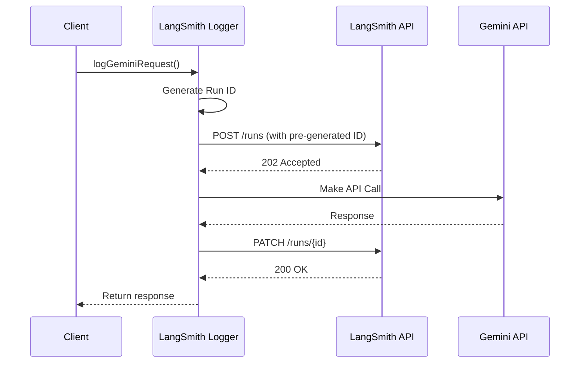

# LangSmith Integration for Quiz Generation

## Overview

This document describes the LangSmith integration for the CourseForge AI quiz generation pipeline. LangSmith provides observability and monitoring for LLM interactions, allowing us to track, debug, and optimize our API calls to both Gemini and OpenAI.

## Architecture

The integration is implemented in `supabase/functions/quiz-generation-v5/utils/langsmith-logger.ts` and provides:

- **Request/Response Logging**: Full capture of both Gemini and OpenAI API interactions
- **Trace Visualization**: Web-based UI for viewing execution traces
- **Token Usage Tracking**: Monitor API usage and costs for both providers
- **Error Tracking**: Automatic capture of failures and errors
- **Tagging**: Organized by provider, model, function type, and processing mode

## Configuration

### Environment Variables

Add these to your `.env.local` file:

```bash
# LangSmith Configuration
LANGSMITH_API_KEY=your_api_key_here
LANGSMITH_PROJECT=pr-drab-plowman-55
```

### Getting Your API Key

1. Sign up for [LangSmith](https://smith.langchain.com/)
2. Navigate to Settings → API Keys
3. Create a new API key and copy it
4. Add it to your `.env.local` file

## How It Works

### 1. Automatic Integration

The logger is automatically invoked when:
- Planning stage analyzes video content (Gemini)
- Text-based prompts are processed (both providers)
- Any Gemini API call is made through the LLM service
- Any OpenAI API call is made through the LLM service

### 2. Run Creation Flow



### 3. Data Captured

Each run captures:

#### For Gemini:
- **Inputs**: Full prompt, model configuration, video metadata
- **Outputs**: Response text, token usage (prompt/completion/total), timing
- **Metadata**: Model name (e.g., gemini-2.0-flash), endpoint, video details
- **Tags**: `gemini`, model name, `quiz-generation`, `video-analysis`/`text-only`

#### For OpenAI:
- **Inputs**: Messages array, model config, response format schema
- **Outputs**: Response text, token usage, timing
- **Metadata**: Model name (e.g., gpt-4o-2024-08-06), endpoint, JSON mode status
- **Tags**: `openai`, model name, `quiz-generation`, `text-only`

## Usage

### Viewing Traces

1. After running quiz generation, check the logs for trace URLs:
   ```
   [LangSmith] View trace: https://smith.langchain.com/o/.../r/{run_id}
   ```

2. Click the URL to view:
   - Full request/response data
   - Token usage and costs
   - Execution timeline
   - Error details (if any)

### Debugging Failed Runs

If you see errors like:
```
[LangSmith] No run found for request: req_xxx
```

This usually means:
1. The run creation failed (check API key)
2. The project name is incorrect
3. Network issues prevented the initial request

### Performance Impact

The logger is designed to be non-blocking:
- Runs are created asynchronously
- Failures don't affect the main pipeline
- Logging can be disabled by removing the API key

## Troubleshooting

### Common Issues

1. **"No API key found" Warning**
   - Ensure `LANGSMITH_API_KEY` is set in `.env.local`
   - Restart the Supabase functions server

2. **"No run ID in response" Error**
   - This is now resolved - we pre-generate run IDs
   - If you still see it, check your API key permissions

3. **Trace URLs Not Working**
   - Verify the project name matches your LangSmith project
   - Ensure you're logged into LangSmith

4. **Duplicate Environment Variables**
   - Run the cleanup script if you have duplicate entries
   - Ensure only one instance of each variable exists

### Debug Mode

Enable detailed logging by checking the console output:
```
[LangSmith] Initialized with:
[LangSmith]   API Key: lsv2_pt_...
[LangSmith]   Project: pr-drab-plowman-55
[LangSmith]   API URL: https://api.smith.langchain.com/api/v1
```

## Advanced Features

### Helper Functions

The logger provides convenience functions for both providers:

```typescript
// For Gemini API calls
import { logGeminiCall } from '../utils/langsmith-logger.ts';

const response = await logGeminiCall(
  'https://generativelanguage.googleapis.com/v1beta/models/gemini-2.0-flash:generateContent?key=...',
  requestBody,
  'Planning Stage - Generating question plans'
);

// For OpenAI API calls
import { logOpenAICall } from '../utils/langsmith-logger.ts';

const response = await logOpenAICall(
  'https://api.openai.com/v1/chat/completions',
  requestBody,
  'Generating MCQ question',
  apiKey // optional, defaults to OPENAI_API_KEY env var
);
```

### Custom Tags

You can add custom tags to traces by modifying the logger calls:
```typescript
await langsmithLogger.logGeminiRequest(
  requestId,
  model,
  prompt,
  config,
  videoMetadata,
  ['custom-tag', 'experiment-v2']  // Custom tags
);
```

### Filtering Traces

In the LangSmith UI, you can filter by:
- Tags (e.g., `video-analysis`, `text-only`)
- Model name
- Time range
- Error status
- Token usage

## Best Practices

1. **Use Meaningful Run Names**: The logger automatically creates descriptive names
2. **Check Token Usage**: Monitor costs through the LangSmith dashboard
3. **Review Errors**: Failed runs are tagged with error details
4. **Leverage Filters**: Use tags to segment different types of requests

## Future Enhancements

- [ ] Batch ingestion for high-volume scenarios
- [ ] Custom evaluators for quiz quality
- [ ] Automated alerts for error rates
- [ ] Cost tracking and budgets
- [ ] A/B testing support for prompts

## API Response Format

### Gemini Response Structure
The logger expects this structure from Gemini:

```json
{
  "candidates": [{
    "content": {
      "parts": [{
        "text": "{ ... JSON response ... }"
      }]
    }
  }],
  "usageMetadata": {
    "promptTokenCount": 1234,
    "candidatesTokenCount": 567,
    "totalTokenCount": 1801
  }
}
```

### OpenAI Response Structure
The logger expects this structure from OpenAI:

```json
{
  "choices": [{
    "message": {
      "content": "{ ... JSON response ... }"
    },
    "finish_reason": "stop"
  }],
  "usage": {
    "prompt_tokens": 1234,
    "completion_tokens": 567,
    "total_tokens": 1801
  },
  "model": "gpt-4o-2024-08-06",
  "system_fingerprint": "..."
}
```

## Security

- API keys are stored in environment variables
- No sensitive user data is logged
- Traces are private to your organization
- Access control via LangSmith permissions 