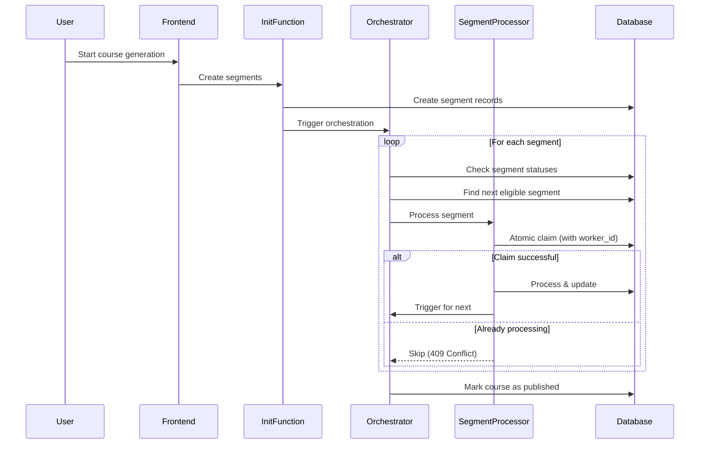

# Robust Segmented Video Processing Architecture

## Overview

This document describes the improved architecture for processing long videos in segments, addressing the issues of concurrent processing, race conditions, and frontend-backend coupling.

## Previous Issues

1. **Concurrent Processing**: Segments were being processed multiple times simultaneously
2. **Race Conditions**: Frontend and backend both triggered segment processing
3. **No Dependency Enforcement**: Segments didn't wait for previous segments to complete
4. **Frontend Coupling**: System relied on browser staying open for recovery

## New Architecture

### Core Components

#### 1. **Atomic Segment Claiming** (`process-video-segment`)
- Uses worker IDs to prevent concurrent processing
- Atomic database operations with conditional updates
- Checks if segment is already being processed before claiming
- Enforces sequential processing (segment N waits for N-1)

#### 2. **Backend Orchestrator** (`orchestrate-segment-processing`)
- Centralized control for segment processing
- Handles stuck segment detection and recovery
- Ensures segments process in order
- No frontend dependency

#### 3. **Database Schema Updates**
- Added `worker_id` column for processing locks
- Added `retry_count` for tracking failures
- Indexed for efficient stuck segment queries

### Processing Flow



### Key Features

#### 1. **Atomic Segment Claiming**
```typescript
// Only processes if status is 'pending' or 'failed'
const { data: claimedSegment } = await supabase
  .from('course_segments')
  .update({ 
    status: 'processing',
    worker_id: workerId,
    processing_started_at: new Date().toISOString()
  })
  .eq('id', segment_id)
  .in('status', ['pending', 'failed'])
  .select()
  .single();
```

#### 2. **Dependency Enforcement**
- Segments only process after previous segment completes
- Context from previous segment is required
- Automatic context retrieval if not provided

#### 3. **Stuck Segment Recovery**
- 5-minute timeout for processing segments
- Automatic reset to 'failed' status
- Retry with incremented retry_count

#### 4. **Frontend Decoupling**
- Frontend only displays progress
- No segment triggering from frontend
- Works even if browser is closed

## Migration Steps

1. **Deploy Database Migration**
   ```bash
   supabase db push
   ```

2. **Deploy New Edge Functions**
   ```bash
   supabase functions deploy orchestrate-segment-processing
   supabase functions deploy process-video-segment
   ```

3. **Update Frontend**
   - Remove segment recovery checks
   - Keep real-time progress display

## Benefits

1. **Reliability**: No more duplicate processing
2. **Sequential Guarantee**: Proper context flow between segments
3. **Resilience**: Automatic recovery from failures
4. **Independence**: Backend-only orchestration
5. **Scalability**: Can handle videos of any length

## Monitoring

Monitor the orchestrator logs to track:
- Segment processing times
- Retry attempts
- Stuck segment recovery
- Overall pipeline health

```bash
supabase functions logs orchestrate-segment-processing --tail
supabase functions logs process-video-segment --tail
```

## API Reference

### Orchestrate Segment Processing
```http
POST /functions/v1/orchestrate-segment-processing
{
  "course_id": "uuid",
  "check_only": false  // true = status check, false = process next
}
```

### Process Video Segment (Enhanced)
- Now includes atomic claiming
- Returns 409 Conflict if already processing
- Returns 425 Too Early if dependencies not met

## Future Enhancements

1. **Parallel Processing**: Process non-dependent segments in parallel
2. **Priority Queue**: Process high-priority courses first
3. **Distributed Locking**: Use Redis for distributed locks
4. **Webhook Notifications**: Notify when processing completes 